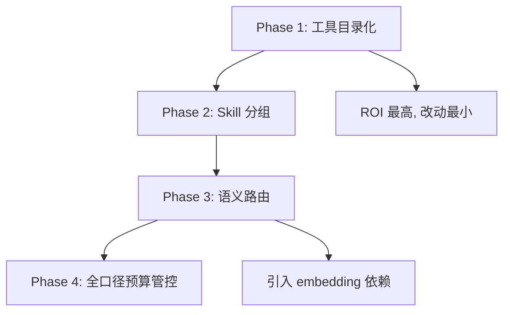
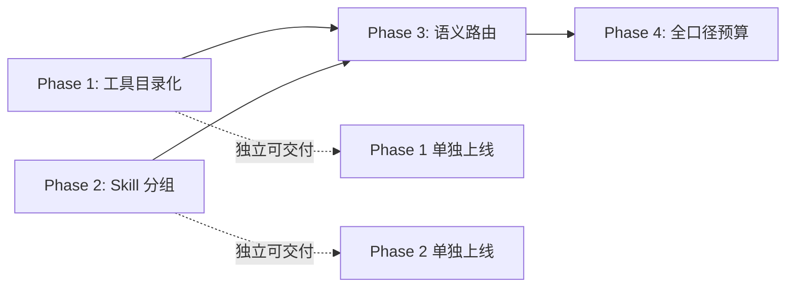

# PRD: 大规模 Skill/Tool 架构治理方案

> 状态：🟡 设计中
> 日期：2026-07-23
> 作者：agent-core 团队

## 1. 背景与问题

当前 agent-core 的工具和技能选择采用"全量传递"模式——所有注册的 Tool schema 和 Skill 描述在每次 LLM 调用时全量注入上下文。当 skill/tool 数量增长到 100+ 时，将面临两个核心问题：

### 1.1 上下文爆炸

| 资源 | 当前规模 | 100+ 时预估 | 上下文窗口占比 |
|------|---------|------------|--------------|
| Tool schema（function-calling 格式） | ~10 个 ≈ 10K tokens | ~100 个 ≈ 80-100K tokens | 60-80% |
| Skill 描述（XML 注入 system_prompt） | ~5 个 ≈ 1K tokens | ~100 个 ≈ 15-20K tokens | 12-15% |
| 消息历史 | 可控（已有 compaction） | 可控 | ~20% |
| **总计** | **~25K** | **~120K+** | **超过 128K 窗口** |

### 1.2 选择精准度下降

- 100+ 工具全部暴露给 LLM，function-calling 的准确率会显著下降（研究表明 >30 个工具时选择准确率开始衰减）
- 直答模式（ReAct）完全没有工具过滤机制，所有工具平等竞争
- Plan-Execute 模式虽有 `suggested_tools` 步骤级白名单，但仅覆盖复杂任务场景

## 2. 现状分析

### 2.1 当前架构关键路径

```
用户输入 → Agent Loop (loop.py)
  → tools_to_provider_format(context.tools)   # 全量转换
  → provider.stream(messages, tool_defs)       # 全量传递给 LLM
  → LLM 选择工具 → tool_runner 执行
```

### 2.2 已有的过滤机制

| 机制 | 位置 | 触发条件 | 覆盖范围 |
|------|------|---------|---------|
| `filter_active_tools` | `session/tool_utils.py` | `active_tool_names is not None` | 基础设施层 |
| `set_active_tools` | `harness.py` | Planning 模块调用 | 仅 Plan-Execute |
| `_sync_action_space` | `planning/context.py` | `before_agent_start` + `manage_plan` 调用后 | 仅 Plan-Execute |

**核心缺口**：直答模式（ReAct）下 `active_tool_names` 始终为 `None`，等同于全量传递。

### 2.3 已有的上下文管理

- 三层压缩体系：Budget 预检查 → Semantic Compress → Compaction 摘要
- 但压缩仅针对消息历史，**无法压缩 tool schema**（每轮 LLM 调用都需要完整 schema）

### 2.4 已有数据结构适配性

```python
# ToolDefinition (tools/base.py) 已有 prompt_snippet 字段
class ToolDefinition(BaseModel):
    name: str
    description: str              # 完整描述 → 给 function-calling schema
    prompt_snippet: str | None    # 一句话描述 → 天然适合做"目录"
    parameters: dict
    ...

# Skill (resources/types.py) 已有 tools 关联字段
@dataclass
class Skill:
    name: str
    description: str
    tools: list[str] = []         # 关联工具列表 → 可用于分组路由
    ...
```

## 3. 设计方案

### 3.1 核心架构：三层工具可见性

```
┌─────────────────────────────────────────────────────┐
│  System Prompt                                      │
│  ┌─────────────────────────────────────────────┐    │
│  │ 工具目录（100+ 个 name + 一句话描述）        │ ← ~3-5K tokens
│  │ "你可以使用以下工具，如需完整参数说明         │
│  │  请调用 tool_detail(name)"                   │    │
│  └─────────────────────────────────────────────┘    │
├─────────────────────────────────────────────────────┤
│  Active Tools（15-20 个完整 function-calling schema）│ ← ~15K tokens
│  由 Router 预筛 / Plan 步骤白名单决定               │
├─────────────────────────────────────────────────────┤
│  元工具: tool_detail（始终可用）                     │ ← ~0.5K tokens
└─────────────────────────────────────────────────────┘
```

LLM 的行为模式：
- **90% 场景**：Router 预筛的 15-20 个工具已覆盖需求，直接调用（零额外开销）
- **10% 场景**：LLM 从目录中识别所需工具，调用 `tool_detail` 获取完整 schema 后再调用

### 3.2 实施路径（四阶段渐进式）



#### Phase 1: 工具目录化（Level 0/1 分层）

**目标**：system_prompt 中仅保留工具目录，完整 schema 按需加载

**改动范围**：
1. `prompts/builder.py` — 修改 system_prompt 构建逻辑，工具部分从完整 schema 改为目录格式
2. `core/loop.py` — 在 `tools_to_provider_format` 前插入 Router 预筛（Phase 1 暂用简单策略，Phase 3 替换为语义路由）
3. `tools/meta_tools.py`（新增）— 实现 `ToolDetailTool` 元工具

**Phase 1 的 Router 策略（简单版）**：
- 始终激活核心工具：`bash`, `read`, `write`, `edit`, `tool_detail`
- 场景级工具：根据 Scene 配置的工具白名单激活
- 用户可在 `AgentLoopConfig` 中指定 `default_active_tools`

**上下文节省**：tool schema 从 ~100K 降到 ~5K（目录）+ ~15K（激活）= ~20K

#### Phase 2: Skill 分组 + 按需激活

**目标**：100+ skill 不再全量注入 system_prompt，按功能域分组、按需激活

**改动范围**：
1. `resources/types.py` — Skill 增加 `category` 和 `trigger_keywords` 字段
2. `prompts/builder.py` — `<available_skills>` 只渲染 active skill
3. `resources/loader.py` — 加载时按 category 建立索引

**Skill YAML frontmatter 扩展**：
```yaml
---
name: dev-process-backend
description: Backend development process skill
category: backend          # 新增：功能域分组
trigger_keywords:          # 新增：触发关键词
  - API
  - 接口
  - 后端
tools: bash, read, write
---
```

**激活策略**：
- Phase 2：基于 `trigger_keywords` 关键词匹配（query 中命中关键词 → 激活该 skill）
- Phase 3：复用 ToolRouter 的 embedding 匹配

#### Phase 3: 语义路由（ToolRouter）

**目标**：基于 embedding 相似度动态预筛 Top-K 候选工具

**改动范围**：
1. `routing/`（新增模块）— `ToolRouter` + `ToolIndex`
2. `core/loop.py` — 在 `tools_to_provider_format` 前调用 Router
3. `skill_evolution/store.py` — 复用 Trace 存储记录路由命中/遗漏数据

**核心流程**：
```
用户输入 → ToolRouter.route(query, top_k=15)
  → embedding 相似度匹配
  → 返回 Top-K 工具名列表
  → filter_active_tools(registry, top_k ∪ plan_step_tools)
  → 传递给 LLM
```

**与 Planning 模块的协同**：
- 直答模式：`active_tools = Router(query)`
- Plan-Execute 模式：`active_tools = Router(query) ∩ step.suggested_tools`（双重精准）

**精准度监控**（复用 skill_evolution 的 Trace 机制）：
```python
{
    "query": "帮我部署到线上",
    "router_top_k": ["bash", "file_write", ...],
    "actual_called": ["docker_build", "bash"],
    "missed": ["docker_build"],          # called - top_k = 遗漏
    "recovered_via": "tool_detail"       # 兜底恢复方式
}
```

#### Phase 4: 全口径上下文预算管控

**目标**：将上下文预算检查从仅覆盖消息历史扩展到工具定义和 skill 注入

**改动范围**：
1. `compaction/budget.py` — 扩展预算计算，覆盖 tool schema + skill 注入
2. `prompts/builder.py` — 增加 token 预算检查，超限时自动折叠目录格式

**预算分配模型**（以 128K 窗口为例）：
```
上下文窗口 128K tokens
├── System Prompt 基础: ~5K
├── 工具目录: ~5K（100+ 个）
├── Active Tool Schemas: ~15K（15-20 个）
├── Active Skills: ~3K（5-10 个）
├── Working Memory Pinned: ~2K
├── 消息历史: ~70K（compaction 控制）
└── 输出预留: ~23K
```

### 3.3 元工具设计

#### ToolDetailTool

```python
class ToolDetailTool:
    """让 LLM 按需查询任意工具的完整定义"""
    
    definition = ToolDefinition(
        name="tool_detail",
        description="获取指定工具的完整参数说明和使用示例。"
                    "当你需要的工具不在当前可用列表中，"
                    "但你知道它的名字时使用。",
        parameters={
            "type": "object",
            "properties": {
                "tool_names": {
                    "type": "array",
                    "items": {"type": "string"},
                    "description": "要查询的工具名列表，支持一次查多个"
                }
            },
            "required": ["tool_names"]
        }
    )
    
    async def execute(self, tool_call_id, params, ctx):
        names = params["tool_names"]
        results = []
        for name in names:
            tool = ctx.tool_registry.get(name)
            if tool:
                results.append(format_tool_schema(tool.definition))
            else:
                results.append(f"Tool '{name}' not found.")
        return ToolResult(content=[TextContent("\n---\n".join(results))])
```

#### ToolSearchTool（可选，200+ 规模时引入）

```python
class ToolSearchTool:
    """当 LLM 不确定工具名时，按关键词搜索工具目录"""
    
    definition = ToolDefinition(
        name="tool_search",
        description="按关键词搜索可用工具。返回匹配的工具名和简介。"
                    "当你不确定是否有合适的工具时使用。",
        parameters={
            "type": "object",
            "properties": {
                "keywords": {
                    "type": "string",
                    "description": "搜索关键词"
                }
            },
            "required": ["keywords"]
        }
    )
```

## 4. 上下文节省效果对比

| 阶段 | Tool Schema | Skill 注入 | 总计 | 相比当前 |
|------|------------|-----------|------|---------|
| 当前 | ~100K（全量） | ~15K（全量） | ~115K | 基准 |
| Phase 1 | ~20K（目录+激活） | ~15K（全量） | ~35K | **-70%** |
| Phase 1+2 | ~20K（目录+激活） | ~3K（分组激活） | ~23K | **-80%** |
| Phase 1+2+3 | ~20K（精准路由+激活） | ~3K（精准激活） | ~23K | **-80%**（精准度↑） |
| 全阶段 | ~20K（预算管控） | ~3K（预算管控） | ~23K（硬上限） | **-80%** + 防爆 |

## 5. 风险评估与缓解

| 风险 | 概率 | 影响 | 缓解措施 |
|------|------|------|---------|
| Router 遗漏关键工具 | 中 | 高 | 目录兜底 + `tool_detail` 元工具 + Trace 监控 missed 比例 |
| `tool_detail` 增加一轮交互延迟 | 高 | 低 | Router 准确率 >90% 时仅 10% 请求触发，可接受 |
| Skill 分组误判导致 skill 不可见 | 低 | 中 | `trigger_keywords` 支持多关键词 OR 匹配，宁多激活不少激活 |
| embedding 模型引入外部依赖 | 中 | 中 | Phase 1-2 不依赖 embedding，Phase 3 可用本地小模型（如 sentence-transformers） |
| 向后兼容：现有 Scene 配置依赖全量工具 | 高 | 中 | `AgentLoopConfig.disable_tool_routing=True` 回退到全量模式 |

## 6. 依赖关系



- Phase 1 和 Phase 2 互相独立，可并行开发
- Phase 3 依赖 Phase 1（需要目录层 + 元工具作为基础设施）
- Phase 4 依赖 Phase 1-3（需要知道各部分的 token 消耗才能做预算管控）

## 7. 与现有模块的集成点

| 现有模块 | 集成方式 | 改动量 |
|---------|---------|-------|
| `ToolRegistry` (`tools/base.py`) | 增加 `get_catalog()` 方法生成目录 | 小 |
| `filter_active_tools` (`session/tool_utils.py`) | 复用，Router 输出作为 `active_tool_names` | 无 |
| `PlanningContextExtension._sync_action_space` | Router 结果与 step.suggested_tools 取交集 | 小 |
| `SystemPromptBuilder` (`prompts/builder.py`) | 工具部分改为目录格式 + skill 分组渲染 | 中 |
| `budget.py` (`compaction/budget.py`) | 扩展预算覆盖范围 | 中 |
| `skill_evolution/store.py` | 复用 Trace 存储记录路由数据 | 小 |

## 8. 主流方案参考

| 方案 | 代表项目 | 与本方案的关系 |
|------|---------|--------------|
| Tool Retrieval (ReACT + TR) | Gorilla, ToolLLM | Phase 3 的语义路由即此思路的工程化 |
| Hierarchical Tool Selection | Semantic Kernel | 本方案的"三层可见性"即分层选择 |
| Tool Description Compression | — | Phase 1 的目录化本质是 schema 压缩 |
| Multi-Agent Tool Partitioning | AutoGen, CrewAI | 本方案在单 Agent 内通过 Router 实现等效分区 |

## 9. 推荐实施优先级

1. **Phase 1（工具目录化）**：ROI 最高，改动最小，立即解决上下文爆炸问题
2. **Phase 2（Skill 分组）**：独立可交付，与 Phase 1 并行
3. **Phase 3（语义路由）**：工具数 >50 时开始规划，需要 embedding 基础设施
4. **Phase 4（预算管控）**：Phase 1-3 上线后，基于实际 token 消耗数据调优
