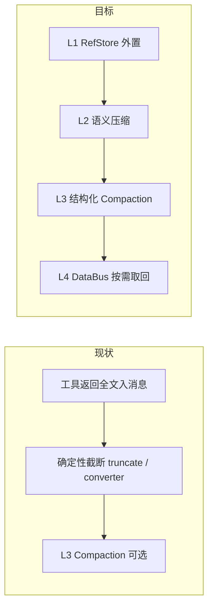
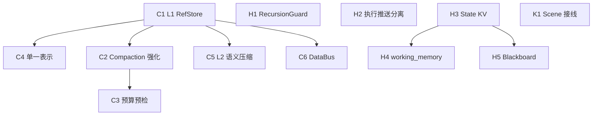

# 基于 Agent 工程演进的优化差距分析

> **用途**：对照 [`docs/reference/agent_engineering.md`](reference/agent_engineering.md) 的优化策略，盘点 `agent-core` 现状，给出可执行的分阶段优化建议。  
> **范围**：差距分析与路线图；本文不实施代码变更。  
> **日期**：2026-07-20  
> **定位**：本仓库是**库级 Agent 运行时 + Scene 示例宿主**，不是企业 Agent OS。优化建议遵守「库 ≠ 服务」边界。

---

## 0. 摘要与成熟度总览

相对参考文档的演进主线（Prompt → Context → Harness → Agent OS），当前项目处于：

| 阶段 | 成熟度 | 一句话 |
|------|--------|--------|
| Prompt | 可用 | `SystemPromptBuilder` + Skills + Context Files 已落地 |
| Context | **半完成** | L1 RefStore MVP + L3 Compaction（Scene 默认）+ 预算预检 MVP；缺 L2/L4、单一表示校验 |
| Harness | **轻量完成** | Thin Core + Thick Harness、HITL、Plan、Multi-agent 已有；缺断点续传、执行账本、声明式绑定 |
| Agent OS | **未开始** | 五层架构 / 双平台 / 治理闭环属愿景，不在近半年必做范围 |

**核心判断**：长链路「越跑越蠢」首先是上下文信噪比问题（文档 §1.2 / §3），不是模型大小问题。近期最高 ROI 在 **P0 Context 防线**，其次是 **Scene 把已有库能力接上**，再谈 Harness 可靠性与赋能工具。

### 已有优势

| 能力 | 现状落点 |
|------|----------|
| L3 Compaction 骨架 | `agent_core/compaction/` + Harness 阈值 / overflow 回调 |
| 工具结果确定性截断 | `tools/truncate.py` + converter `tool_result_max_chars`（默认 4000） |
| Thin Core + Thick Harness | `core/loop.py` + `session/harness.py` |
| HITL 端到端 | `core/human_input.py` + scene `/human-input` + HitlCard |
| Plan（Harness-in-Tool） | `agent_core/planning/` + http_sse/h5 PlanCard（`ENABLE_PLANNING`） |
| Multi-agent 委派 | `agent_core/multi_agent/` + `delegate_task`（`ENABLE_MULTI_AGENT`） |
| MCP / Skill Evolution / Memory | 库级模块存在；Scene 默认接线不全 |

### 现状 vs 目标：Context 四层防线



---

## 1. 对照方法与边界

### 1.1 参照与关联文档

| 文档 | 角色 |
|------|------|
| [`docs/reference/agent_engineering.md`](reference/agent_engineering.md) | **策略源**：优化原则与目标形态 |
| [`docs/agent-framework-optimization-plan.md`](agent-framework-optimization-plan.md) | Thin Core / Thick Harness（多数已落地，本文不重复） |
| [`docs/agent-framework-optimization-plan-phase2.md`](agent-framework-optimization-plan-phase2.md) | 战术质量项；YAGNI 结论本文遵守 |
| [`docs/skill-self-evolution.md`](skill-self-evolution.md) | Skill 进化权威用法，本文只补「接线断裂」 |
| [`docs/design.md`](design.md) | 库级边界与 YAGNI |

### 1.2 成熟度等级定义

| 等级 | 含义 |
|------|------|
| 未实现 | 无代码 |
| 原型 | 测试/局部 hack，无稳定 API |
| 库可用 | `agent_core` 可注入使用，消费者需自行 wiring |
| Scene 已接线 | http_sse / h5 默认或开关可开 |
| 生产级 | 有阈值、降级、审计、测试与文档闭环 |

### 1.3 边界

- **做**：库内 Context / Harness 增强；Scene 闭合已有模块接线。
- **不做**：云端 Control Plane / Slot 池 / 组织级治理（属宿主层，见文档 §5，标 P3 愿景）。
- **不做**：为单次 demo 引入与「库 ≠ 服务」冲突的进程内全局单例。

---

## 2. Context 工程差距（四层防线 + 横切记忆）

对照文档 §3。

### 2.1 能力矩阵

| 策略（文档） | 成熟度 | 现状要点 |
|--------------|--------|----------|
| L1 ToolResultRefStore | 库可用（MVP） | `agent_core/artifacts/`：字符阈值外置为 `artifact_ref`；Scene 默认未接线；无 L4 取回 |
| L2 SemanticCompressor | 未实现 | 无中等结果 LLM 蒸馏；仅有 substring 截断 |
| L3 Compaction | Scene 已接线（MVP） | 结构化 handoff + 安全 cut-point；`ENABLE_COMPACTION=1` 默认注入 http_sse/h5 |
| L4 DataBus | 未实现 | `retrieval/` 是 RAG，非 refId 依赖预取 |
| 单一表示原则 | 未实现 | 内存全文 + converter 再截断 = 双重表示 |
| Working Memory（Pinned/Insights） | 未实现 | `planning/` 是会话内计划，非跨步 working_memory |
| Prompt 预算预检 | Scene/库可用（MVP） | turn 前粗估；先 compact 一次；仍超则 `PROMPT_BUDGET_EXCEEDED` 不调 provider |
| 工具截断 | Scene 已接线 | 多层确定性截断已生产可用 |

### 2.2 优化项明细

#### C1 — L1 ToolResultRefStore（P0）

| 字段 | 内容 |
|------|------|
| **文档出处** | §3.2 L1；§1.3 数据搬运谬误 |
| **现状** | `tools/local/bash.py` temp 外置；`tool_runner` 仍把（截断后）文本写入 messages；converter 再截断 |
| **缺口** | 无框架级阈值外置、无 ref 协议、无按需取回、违反单一表示 |
| **建议改动面** | 新建 `agent_core/artifacts/`（或 `compaction/ref_store.py`）：`ToolResultRefStore` Protocol + InMemory/文件实现；在 `after_tool_call` / tool_runner 出口按阈值（如 >8000 字符或数组 >10）替换为 `artifact_ref`；原始入 store |
| **验收标准** | 超阈值结果进 LLM 的消息仅为 ref + 有界摘要；审计可从 store 取全文；bash 特殊路径收敛到同一协议 |
| **优先级** | P0 |

#### C2 — 强化 L3 Compaction + Scene 接线（P0）

| 字段 | 内容 |
|------|------|
| **文档出处** | §3.2 L3 |
| **现状** | `LLMSummaryCompactor(threshold=0.8, keep_recent=10)`；`summarize_fn` 由消费者注入；自由文本；切分不保证 tool/assistant 配对；`replay_entries` 对 `CompactionEntry` 支持弱 |
| **缺口** | 无结构化交接模板；无目标压缩比（文档建议压到 ~30%）；Scene 未注入 compactor |
| **建议改动面** | ① 提供默认 `summarize_fn` 模板（用户请求 / 阶段历史 / 放弃路径 / ref 索引）；② cut-point 回溯到配对 assistant；③ `scene/*/chat_assistant` 默认构造 `LLMSummaryCompactor` |
| **验收标准** | Scene 默认开启阈值压缩；长会话 token 曲线可观测下降；压缩后消息仍满足 tool 配对；单元测试覆盖 cut-point |
| **优先级** | P0 |

#### C3 — Prompt 预算预检（P0）

| 字段 | 内容 |
|------|------|
| **文档出处** | §3.5 |
| **现状** | `should_compact_threshold` 在 AgentEnd；overflow 时 `compact_callback` 重试；`max_tokens` 只管输出 |
| **缺口** | 无 turn 前估算；无 `PROMPT_BUDGET_EXCEEDED`；无降级顺序 |
| **建议改动面** | `compaction/strategies.py` 扩展预算估算；`loop` / Harness `prepare_next_turn` 前检查；超限：先压 tool preview → 触发 compact → 仍超则失败事件 |
| **验收标准** | 超预算不发起劣质调用；有明确事件/错误码；测试可脚本化超限场景 |
| **优先级** | P0 |

#### C4 — 单一表示校验（随 L1，P0 附带）

| 字段 | 内容 |
|------|------|
| **文档出处** | §3.3 |
| **现状** | store 全文 vs LLM 截断视图并存 |
| **缺口** | Prompt 组装前无 refId 多形态检测 |
| **建议改动面** | converter / PromptBuilder 组装前：同 ref 只允许一种形态；L1 落地后自然消除「全文+截断」双轨 |
| **验收标准** | 同 step 同 ref 多形态时拒绝组装并告警（测试断言） |
| **优先级** | P0（依赖 C1） |

#### C5 — L2 SemanticCompressor（P1，可后置）

| 字段 | 内容 |
|------|------|
| **文档出处** | §3.2 L2 |
| **现状** | 无 |
| **缺口** | 中等文本（如 8K–50K）只能硬截断，信噪比差 |
| **建议改动面** | 独立 Compressor；temperature 低；失败走结构化截断（`__fallbackTruncated`）；**preview 必须用原始 substring**（文档踩坑） |
| **验收标准** | 压缩后 ≤ 目标字符；原文可经 L1 store 取回；失败不污染字段名 |
| **优先级** | P1（L1+L3 之后） |

#### C6 — L4 DataBus（P2）

| 字段 | 内容 |
|------|------|
| **文档出处** | §3.2 L4 |
| **现状** | `retrieval/` = RAG；无 ref 依赖预取 |
| **缺口** | 压缩后模型无法按依赖取回精确数据 |
| **建议改动面** | 轻量 Inspect 工具链（outline / search / context）；system 维护 ref 索引；与 L1 store 对接 |
| **验收标准** | 压缩后仍能按 refId 取回关键任务依赖数据；有预算降级顺序 |
| **优先级** | P2 |

---

## 3. Harness 工程差距（运行时 / 绑定 / 容错）

对照文档 §4。

### 3.1 能力矩阵

| 策略（文档） | 成熟度 | 现状要点 |
|--------------|--------|----------|
| parameterBindings / State KV | 未实现 | 跨步数据靠 LLM 搬运 |
| PERO 编排 | 部分 | Plan 工具化；Execute=ReAct；无 Reflect/Optimize 阶段机 |
| 断点续传 / Checkpoint | 部分 | 会话 transcript 持久化；无执行级 step checkpoint |
| SSE 真相源 + 后台执行 | 部分 | 请求内流式；断连停推送；无事件账本 |
| RecursionGuard / 重复调用硬拦 | 部分 | `max_turns`；companion soft `repeated_tool`；无 tool+args 哈希拦 |
| Action Space 动态裁剪 | 库可用 | `set_active_tools` / profile allowlist；无 plan-step 绑定 |
| Multi-agent + SharedBlackboard | 部分 | delegate 已有；无跨 agent KV |
| step_control / working_memory | 未实现 | 文档赋能工具，代码无 |
| HITL | Scene 已接线 | 完整；parallel 模式不支持 HITL |

### 3.2 优化项明细

#### H1 — 重复工具调用硬拦截 + RecursionGuard（P1）

| 字段 | 内容 |
|------|------|
| **文档出处** | §4.2 可靠性防护；Checklist「Action Space / 改造生产线」 |
| **现状** | `AgentLoopConfig.max_turns`；`companion/observer.repeated_tool` 仅 UI 提示；`allow_nested_delegate=False` |
| **缺口** | 同 tool+args 死循环可烧 token；无深度/环硬拦 |
| **建议改动面** | `core/loop.py` 或 Harness 钩子：近期窗口内相同 `(name, args_hash)` ≥ N → 注入错误 Observation，禁止再调；`multi_agent` 增加 depth/chain 计数 |
| **验收标准** | 测试：脚本化重复调用被拦；嵌套 delegate 超深抛明确错误；不影响合法重试（参数不同） |
| **优先级** | P1 |

#### H2 — 执行与推送分离（最小版）（P1）

| 字段 | 内容 |
|------|------|
| **文档出处** | §4.2「有状态执行与断点续传」 |
| **现状** | `scene/*/server` StreamingResponse 绑定连接；`MessageEnd` 落 SessionStore |
| **缺口** | SSE 断 → 执行真相丢失；无 `Last-Event-ID` 重连；无 BackgroundExecutor |
| **建议改动面** | Scene 层：run 任务入后台 task；事件 append 到 session 旁路队列/表；SSE 只订阅；支持重连 poll 增量。库层可提供 `EventLog` Protocol，实现放 scene |
| **验收标准** | 断连后任务继续；重连可拿到增量事件；关键节点有 checkpoint（至少 LLM/工具完成后） |
| **优先级** | P1（偏 Scene；库提供抽象） |

#### H3 — parameterBindings / 跨步 State KV（最小版）（P1）

| 字段 | 内容 |
|------|------|
| **文档出处** | §1.3；§4.1 赋能范式；§3.4 State |
| **现状** | 无；Plan 只管步骤状态 |
| **缺口** | 长数组 / UUID 靠模型「搬运」→ 截断与幻觉 |
| **建议改动面** | `agent_core/state_kv/` 或挂在 planning 旁：`SessionStateStore`；工具结果可 `bind` 键；下游工具 schema 支持 `{{state.key}}` 由系统注入（**不经 LLM**）；先覆盖 1–2 个高频工具 |
| **验收标准** | 端到端：步骤 A 写入 list/id，步骤 B 参数由系统注入，LLM args 中无该大数组；有单元测试 |
| **优先级** | P1 |

#### H4 — working_memory + Plan 步级 action space（P2）

| 字段 | 内容 |
|------|------|
| **文档出处** | §4.1；§3.4 Working Memory |
| **现状** | `PlanningContextExtension` 注入 plan 摘要；`set_active_tools` 存在 |
| **缺口** | 无 Pinned/Insights 工具；工具集不随当前 plan step 收缩 |
| **建议改动面** | `working_memory` 工具（write pinned / insight）；`PlanningContextExtension` 按 current step 的 `suggested_tools` 调 `set_active_tools` |
| **验收标准** | 多步任务中非当前步工具从 schema 消失；Insights 出现在 prompt 尾部且可滚动淘汰 |
| **优先级** | P2 |

#### H5 — SharedBlackboard（P2）

| 字段 | 内容 |
|------|------|
| **文档出处** | §4.5 多 Agent |
| **现状** | `SubAgentResult.summary` 回传；isolated/forked session |
| **缺口** | 并行子任务无法共享中间产物，只能靠 orchestrator 二次搬运 |
| **建议改动面** | `multi_agent/blackboard.py`：root execution 作用域 KV；注入协作上下文片段 |
| **验收标准** | parallel 子 agent 可读 sibling 写入的 key；有隔离测试（不同 root 不串） |
| **优先级** | P2 |

#### H6 — PERO / step_control（P3 或按需）

| 字段 | 内容 |
|------|------|
| **文档出处** | §4.2 PERO；§4.1 step_control |
| **现状** | Plan 为 Harness-in-Tool，调度权在 LLM |
| **缺口** | 非 runtime 状态机；无 complete/skip/need_info 机械握手 |
| **建议改动面** | 保持「不改 core loop」原则；若需要，用 Extension + 工具扩展，而非引入 DAG 引擎（与现有 plan-execute 规格一致） |
| **验收标准** | 仅在有明确业务需求时立项；默认不排期 |
| **优先级** | P3 |

---

## 4. 知识 · 进化 · Capability 差距

对照文档 §4.3–§4.5、§5。

### 4.1 能力矩阵

| 策略（文档） | 成熟度 | 现状要点 |
|--------------|--------|----------|
| 四层跨执行记忆 | 未实现 | flat `MemoryStore` + RAG `knowledge/` + companion 轻量记忆 |
| Skill 自进化 | 库可用 | `skill_evolution/` 完整；Scene Collector **未注册** |
| Prompt Compiler / Patch 状态机 | 未实现 | Patch 是 SKILL.md 规则变更，无 shadow→active |
| Self-Feedback Engine | 未实现 | 仅有 skill 域窄原型 |
| Capability Runtime | 未实现 | ToolRegistry + Skills 扁平；`/capabilities` 为清单 API |
| MCP | Scene 已接线 | `MCPManager` + env/`.mcp.json`；缺租户级治理 |

### 4.2 优化项明细

#### K1 — 闭合 SkillTraceCollector / Memory / feedback 接线（P2，但 ROI 极高）

| 字段 | 内容 |
|------|------|
| **文档出处** | §4.4；Checklist「可观测性先行」 |
| **现状** | Scene 默认接线：`ENABLE_MEMORY=1` → inmemory；`ENABLE_SKILL_EVOLUTION=1` → Collector；`POST /skills/evolution/feedback` |
| **缺口** | 进程内 memory 无界；session dispose 未 forget；跨 user 作用域未做 |
| **建议改动面** | （已交付接线）后续按需 forget / 换持久 backend |
| **验收标准** | 默认路径下 analyze 能读到真实 trace；memory recall 出现在后续 turn；feedback 可写入 |
| **优先级** | P2（已交付接线；运维 hardening 另立） |

#### K2 — Capability Runtime 迁移（P3）

| 字段 | 内容 |
|------|------|
| **文档出处** | §4.5 |
| **现状** | 装配逻辑散落在 `ChatAssistant.create` |
| **缺口** | 新能力源需改宿主；无 tool_pack / workflow_tool |
| **建议改动面** | 增量引入 `Capability` Protocol，先包装现有 skill/tool/mcp，再统一 `/capabilities` |
| **验收标准** | 新增一种 capability kind 无需改 loop；回归测试通过 |
| **优先级** | P3 |

#### K3 — Self-Feedback / 四层记忆（P3 愿景）

| 字段 | 内容 |
|------|------|
| **文档出处** | §4.3–4.4；§5 L3/L5 |
| **现状** | 无统一引擎；无 Policy/Strategy/Action Chain |
| **缺口** | 跨执行学习与治理 |
| **建议改动面** | 先扩展 skill_evolution 的 outcome 归一；再考虑独立 `feedback/`；四层记忆需产品定义后再动库 |
| **验收标准** | 单独立项；本文不排进近半年必做 |
| **优先级** | P3 |

---

## 5. Scene 接线断裂点（库有、宿主未开）

这是「低成本高收益」清单，优先于造新轮子。

| 模块 | 库状态 | Scene 现状 | 建议 |
|------|--------|------------|------|
| Compaction | `LLMSummaryCompactor` + 结构化 handoff | http_sse/h5 默认注入（`ENABLE_COMPACTION`） | 保持；可后续换 LLM summarize |
| MemoryExtension | 适配器齐全 | `ENABLE_MEMORY=1` 默认 inmemory（进程共享 store） | 保持；可换 mem0/openviking |
| SkillTraceCollector | Extension 就绪 | `ENABLE_SKILL_EVOLUTION=1` 默认注册；`POST /skills/evolution/feedback` | 保持 |
| Planning | 已接线 | `ENABLE_PLANNING=1` 默认开 | 保持 |
| Multi-agent | 已接线 | 需 `ENABLE_MULTI_AGENT` | 保持可选 |
| MCP | 已接线 | env / `.mcp.json` | 保持；补健康检查（见 phase2） |

---

## 6. 分阶段优化路线图（P0–P3）

### P0 — Context 信噪比（建议 1–2 个迭代）

1. **C1** L1 ToolResultRefStore + 单一表示（C4）
2. **C2** 结构化 Compaction + Scene 默认接线
3. **C3** Prompt 预算预检
4. （可选插队）**K1 接线周**：Memory + SkillTraceCollector + feedback API

**成功标准**：同场景长链路工具调用下，进入 LLM 的 tool 噪音显著下降；超预算可失败可观测；Scene 默认具备压缩能力。

### P1 — Harness 可靠性

1. **H1** 重复调用硬拦 + RecursionGuard
2. **H2** 执行/推送分离最小版（Scene + EventLog Protocol）
3. **H3** State KV / parameterBindings 最小版
4. **C5** L2 语义压缩（在 L1 稳定后）

**成功标准**：死循环可拦；断连可续看；跨步 ID/列表不再经 LLM 全文搬运。

### P2 — 赋能与协作

1. **H4** working_memory + plan-step action space
2. **H5** SharedBlackboard
3. **C6** DataBus / Inspect 链
4. 完成 **K1**（若未在 P0 做完）

### P3 — Agent OS 方向（不排期，只定原则）

- Capability Runtime、四层记忆、Self-Feedback、Policy 人审、云端双平台
- **原则**：宿主层建设；库只提供 Protocol 与最小默认实现；任何 Policy 变更必须人审

### 推荐实施顺序（依赖）



---

## 7. 明确不做 / 已有文档覆盖项

### 7.1 本文不重复推进

| 项 | 原因 |
|----|------|
| Thin Core 再瘦身 / Hook 类型化大重构 | phase1 多数已落地；见 FEATURES / harness 现状 |
| MemoryStore `update`/`list`、记忆去重等 | phase2 自我审查标为 **YAGNI** |
| 完整 DAG Plan-and-Execute / Tree-of-Thought | 与现有 plan-execute 规格冲突；文档亦不推荐 ToT |
| 企业 Agent OS 五层 + OpenClaw 双平台 | 超出库职责；标愿景即可 |
| 用更大 context window「解决」衰减 | 文档 §1.2：扩大物理容量 ≠ 提高有效容量 |

### 7.2 决策 Checklist（实施任何优化前自问）

摘自文档 §6.3，适配本仓库：

1. 现象是模型能力还是上下文质量？（先 dump 信噪比）
2. 是否在让 LLM 做数据搬运？→ State / bindings
3. 膨胀发生在哪一层？单次大结果 / 中等文本 / 累积 / 取回缺失
4. 是否违反单一表示？
5. 是否可用确定性逻辑替代 LLM？
6. 防御层有无触发数据？无数据不加层、不减负
7. 失败能否从事件账本恢复？
8. 新工具是否扩大无治理 Action Space？
9. 变更是否只需 Scene 接线而非新模块？

### 7.3 设计原则速记（实施约束）

```
分层拦截 > 全能银弹
确定性 > 管道中的智能
事前治理 > 事后修复
赋能（消除错误条件）> 防御（修补错误后果）
系统强制执行 > Prompt 标语
信息生命周期管理 > 简单截断
有效容量 > 物理容量
库提供抽象 > 库内建云服务
```

---

## 附录 A：完整能力矩阵

| 能力 | 设计文档 | 代码 | Scene | 建议优先级 |
|------|----------|------|------|------------|
| L1 RefStore | §3.2 | 库可用（MVP） | — | P0 已交付库；Scene 接线待定 |
| L2 SemanticCompress | §3.2 | 未实现 | — | P1 |
| L3 Compaction | §3.2 | Scene 已接线（MVP） | 默认开 | P0 已交付 |
| L4 DataBus | §3.2 | 未实现 | — | P2 |
| 单一表示 | §3.3 | 未实现 | — | P0 |
| 预算预检 | §3.5 | 库可用（MVP） | 随 loop 默认开 | P0 已交付 |
| 工具截断 | — | 生产级 | 已接线 | 维持 |
| parameterBindings | §4.1 | 未实现 | — | P1 |
| Plan / manage_plan | — | 库+Scene | 已接线 | 维持 |
| PERO runtime | §4.2 | 未实现 | — | P3 |
| Checkpoint / 后台执行 | §4.2 | 部分 | 部分 | P1 |
| RecursionGuard | §4.2 | 部分 | soft only | P1 |
| active_tools | §4.1 | 库可用 | 间接 | P2 步级 |
| HITL | — | 生产级 | 已接线 | 维持 |
| Multi-agent | §4.5 | 库+Scene | 开关 | 维持 |
| SharedBlackboard | §4.5 | 未实现 | — | P2 |
| working_memory | §4.1 | 未实现 | — | P2 |
| Memory 跨会话 | §4.3 | Scene 已接线（MVP） | 默认 inmemory | P2/接线 已交付 |
| Skill Evolution | §4.4 | Scene 已接线（MVP） | Collector 默认挂 | P2/接线 已交付 |
| Self-Feedback | §4.4 | 未实现 | — | P3 |
| Capability Runtime | §4.5 | 未实现 | 清单 API | P3 |
| MCP | — | 库+Scene | 已接线 | 维持+硬化 |
| Agent OS L1–L5 | §5 | 未实现 | — | 愿景 |

---

## 附录 B：关键代码索引

```
agent_core/compaction/compactor.py      # LLMSummaryCompactor
agent_core/compaction/strategies.py     # token 估算 / 阈值
agent_core/tools/truncate.py            # 确定性截断
agent_core/providers/message_converter.py
agent_core/session/harness.py           # compactor / tool_result_max_chars / max_turns
agent_core/core/loop.py                 # overflow compact_callback / max_turns
agent_core/planning/                    # Plan Harness-in-Tool
agent_core/multi_agent/                 # delegate_task
agent_core/memory/                      # MemoryStore + Extension
agent_core/skill_evolution/             # Trace → Patch（SKILL.md）
agent_core/retrieval/                   # RAG（非 DataBus）
agent_core/tools/mcp_tool.py
scene/http_sse/chat_assistant.py        # 装配入口（接线主战场）
scene/h5/chat_assistant.py
docs/reference/agent_engineering.md     # 策略源
```

---

## 附录 C：与参考文档 Checklist 的映射

| Checklist 问题 | 本仓库优先动作 |
|----------------|----------------|
| 模型 vs 上下文质量？ | P0：C1/C2/C3 |
| LLM 是否在做数据搬运？ | P1：H3 |
| 膨胀在哪一层？ | 先 L1 再 L3 再 L2/L4 |
| 单一表示？ | C4 随 L1 |
| 确定性替代 LLM？ | 截断/绑定/Guard，而非更多 Prompt 标语 |
| 防御层有数据支撑？ | K1 先接线可观测，再减负 |
| 失败能否断点恢复？ | H2 |
| Action Space 治理？ | H4 步级裁剪 |
| 知识是建议还是规则？ | P3 Policy；近期用 Skill 规则 + ValidationGate |
| 变更走治理门控？ | Skill apply 保持人工；Policy 永不自动 active |
