# agent-core 后端架构设计文档

> 自顶向下分模块分析 · 核心关注：Loop、Agent、扩展系统、Skill/工具系统、多智能体系统

---

## 一、系统全景架构

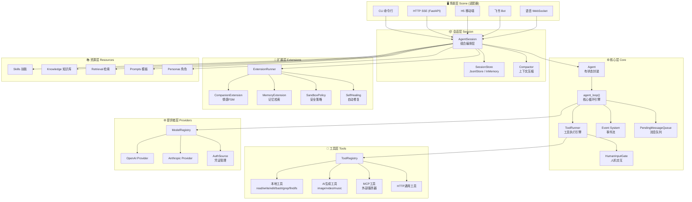

**设计意图：** 系统采用六层分层架构，核心原则是**依赖方向单向向下**，每层只依赖下层，不反向引用。

- **场景层**是薄适配器，负责将各端协议（CLI/SSE/WS/飞书API）翻译为统一的内部调用，不包含业务逻辑。这样新增一个场景（如 Slack Bot）只需写一个适配器，无需改动核心代码。
- **会话层**是组合编排层，将 Agent、存储、扩展、压缩四大关注点组装在一起。分离存储（SessionStore）和压缩（Compactor）是为了让核心引擎保持无状态，会话恢复和上下文窗口管理由外部注入。
- **核心层**是整个系统的心脏，采用 async generator 管道模式——`agent_loop()` 是一个纯函数式的 async generator，通过 `yield` 产出事件流，本身不持有任何外部引用。所有外部依赖（LLM调用、工具执行、Hook）通过 `AgentLoopConfig` 以策略函数注入，实现了核心逻辑与外部世界的完全解耦。
- **扩展层**采用 Protocol（结构化子类型）而非继承，任何实现了 4 个 Hook 方法的类都是合法扩展，无需显式继承基类。这让第三方扩展零耦合接入。
- **工具层**用 Registry 模式统一管理异构工具源（本地/远程/AI生成/MCP协议），LLM 只需看到一个扁平的工具名称列表，不关心工具来自哪里。
- **资源层**将技能、知识库、提示词模板等配置资源统一加载，支持项目级/用户级/显式路径三级搜索和同名冲突检测。

---

## 二、Agent Loop 核心循环引擎

### 2.1 整体执行流程

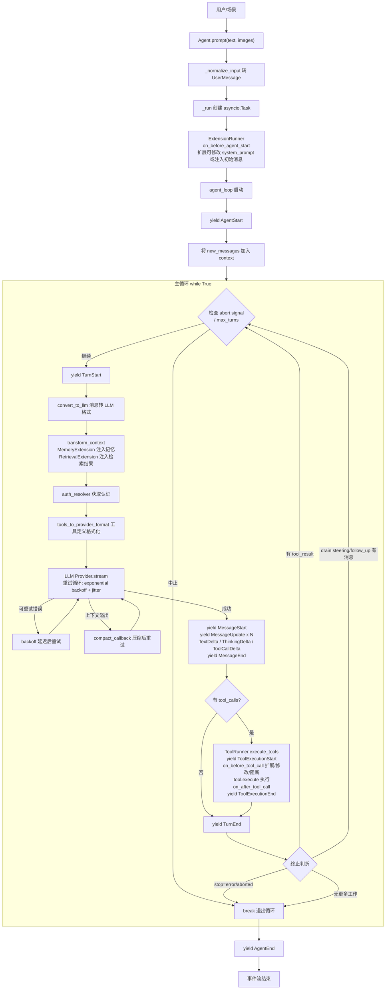

### 2.2 Loop 内部数据流

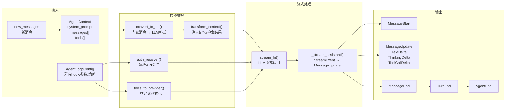

### 2.3 重试与容错机制

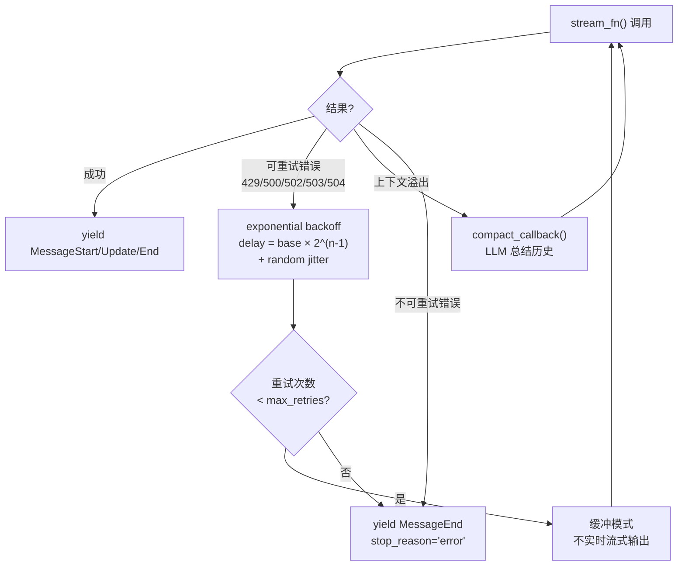

### 2.4 工具执行模式

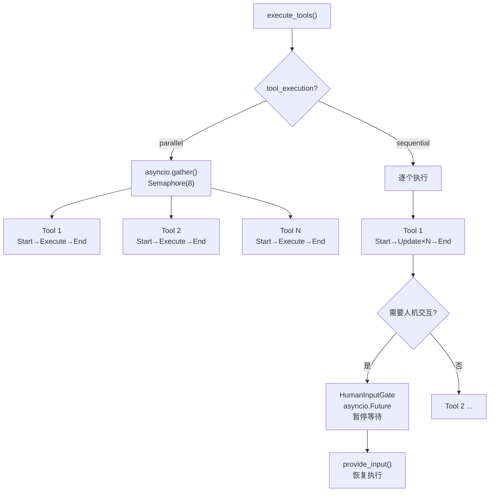

**设计意图：** Agent Loop 是整个框架的核心调度器，设计为一个**纯 async generator 函数**，这是整个架构中最关键的设计决策。

**为什么用 async generator 而不是回调/事件总线？** 因为 LLM Agent 的执行本质是一个**多轮对话流**——LLM 可能连续调用多个工具、需要等待人类输入、可能因为上下文溢出而压缩重试。这些场景用回调会导致深层嵌套和状态追踪困难，而 async generator 天然支持「暂停-恢复-继续」的控制流，`yield` 既是事件输出点也是暂停点，代码读起来就像同步的顺序逻辑。

**主循环的终止策略：** 循环不是固定轮次，而是由 `stop_reason` 驱动——LLM 返回 `stop` 且没有待处理的工具结果、steering/follow_up 队列为空时才退出。这确保了工具调用链能自动串联（LLM 调用工具→拿到结果→继续思考→再调用工具），同时通过 `max_turns` 和 `abort signal` 防止无限循环。

**双队列设计的考量：** `steering_queue`（one-at-a-time）用于运行时插入高优先级指令，每次只取一条确保即时响应；`follow_up_queue`（all）用于批量追加问题，一次性 drain 保证上下文完整。两者在每轮结束时检查，让 Agent 可以在一轮对话中响应多个用户意图。

**重试机制的分层设计：** 首次调用实时流式输出（用户立即看到响应）；重试时切换为缓冲模式（避免客户端看到失败的部分输出）。可重试错误用 exponential backoff + jitter 避免惊群效应；上下文溢出单独处理——调用 `compact_callback` 压缩历史后自动重试，对上层透明。

---

## 三、Agent 有状态封装

### 3.1 Agent 组件关系图

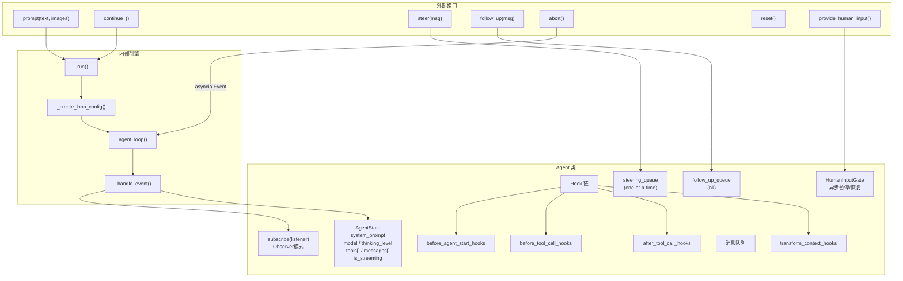

### 3.2 Hook 链执行模型

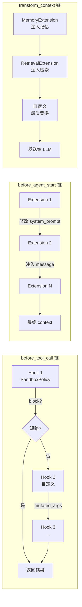

**设计意图：** Agent 是 `agent_loop()` 的有状态封装层，解决「纯函数循环无法被外部控制」的问题。

**为什么要分离 Agent 和 agent_loop？** `agent_loop()` 是纯函数，不持有状态、不管理生命周期。Agent 负责持有 `AgentState`（消息历史、工具列表、当前模型），管理队列、Hook 链和 abort 信号。这样同一个 loop 函数可以被不同 Agent 实例复用，也方便单元测试时直接调用纯函数。

**Hook 链采用中间件模式而非事件总线的理由：** Hook 需要支持**短路**（block 阻断工具调用）、**修改**（mutated_args 改写参数）、**链式传递**（后一个 Hook 看到前一个的修改结果）。事件总线是广播式的，无法实现这些语义。Hook 链按注册顺序串行执行，一旦某个 Hook 返回 `block=True` 立即短路，保证安全策略（如 SandboxPolicy）的优先级最高。

**Observer 模式用于事件分发：** `subscribe(listener)` 返回取消订阅函数，支持同步/异步混合监听。这比事件总线更轻量，且支持精确控制订阅生命周期。Session 层通过 subscribe 监听事件完成持久化，场景层通过 subscribe 将事件转为 SSE/WS 输出。

---

## 四、扩展系统 (Extension System)

### 4.1 扩展生命周期

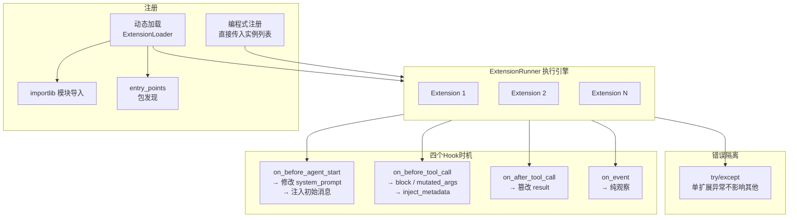

### 4.2 扩展执行流程

```mermaid
graph TB
    subgraph Agent启动阶段
        S1["Session 调用 Runner"] --> S2["Extension 1: SandboxPolicy<br/>on_before_agent_start"]
        S2 --> S3["Extension 2: CompanionExtension<br/>inject companion context"]
        S3 --> S4["Extension 3: MemoryExtension<br/>(pass)"]
    end

    subgraph 工具调用前
        T1["Session 调用 Runner"] --> T2["SandboxPolicy<br/>block: false, mutated_args: quota_adjusted"]
        T2 --> T3["CompanionExtension<br/>(pass)"]
    end

    subgraph 工具调用后
        A1["Session 调用 Runner"] --> A2["SandboxPolicy<br/>on_after_tool_call"]
        A2 --> A3["CompanionExtension<br/>update emotion"]
    end

    subgraph 每个事件广播
        E1["Session 调用 Runner"] --> E2["SandboxPolicy<br/>on_event"]
        E2 --> E3["CompanionExtension<br/>EmotionFSM.transition"]
        E3 --> E4["MemoryExtension<br/>收集pending记忆"]
    end
```

**设计意图：** 扩展系统是框架的开放点，让核心逻辑保持不变的同时插入横切关注点（安全、记忆、伴侣等）。

**为什么用 Protocol 而不是 ABC？** Python 的 Protocol（PEP 544）实现结构化子类型——只要类实现了指定的方法签名就是合法扩展，无需 `class MyExt(Extension)`。这让第三方开发者无需依赖 agent-core 的包就能编写兼容扩展，也避免了多重继承的复杂性。

**四个 Hook 时机的设计考量：**
- `on_before_agent_start`：修改 system_prompt 或注入初始消息，用于 Persona 覆盖、Companion 上下文注入等场景。链式传递让后续扩展看到前面的修改。
- `on_before_tool_call`：安全拦截的核心位置。支持 `block`（阻断危险命令）、`mutated_args`（调整沙箱配额）、`inject_metadata`（注入执行上下文）。短路语义确保安全检查不被绕过。
- `on_after_tool_call`：篡改工具结果，用于 Companion 情绪更新、日志审计等场景。
- `on_event`：纯观察，无返回值。用于 Trace 收集、事件转发等不影响主流程的场景。

**错误隔离原则：** 每个扩展的执行都包裹在 try/except 中，单个扩展异常只记 warning 日志，不影响其他扩展和主流程。这是为了防止非核心功能（如伴侣宠物）的 bug 导致整个 Agent 崩溃。

---

## 五、工具系统 (Tool System)

### 5.1 工具注册与发现架构

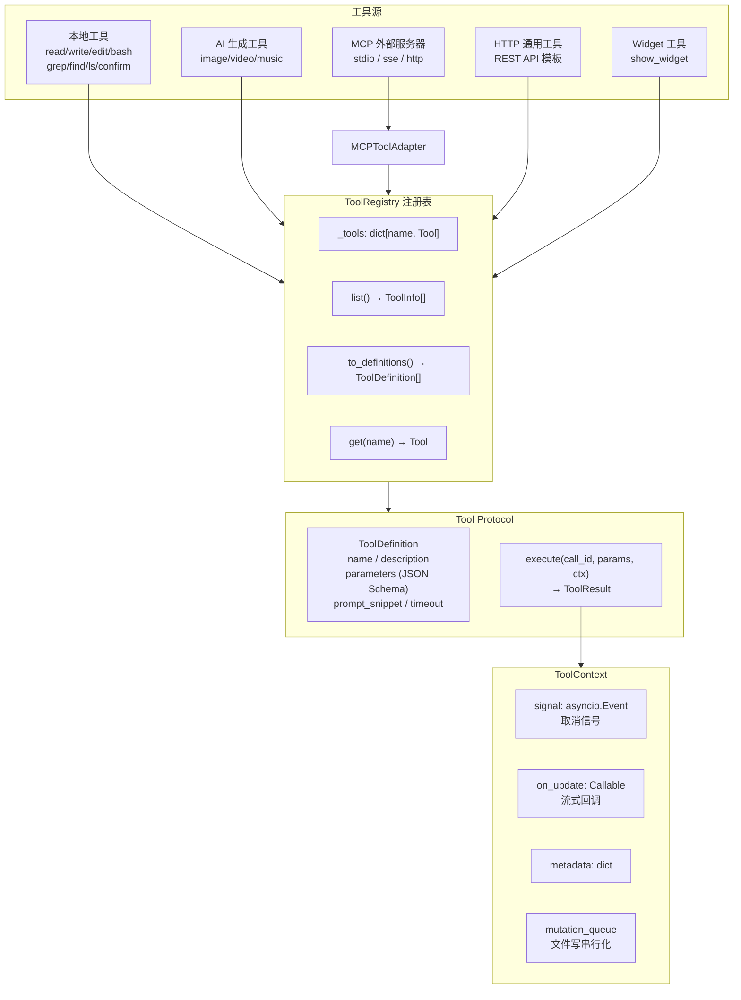

### 5.2 MCP 工具集成架构

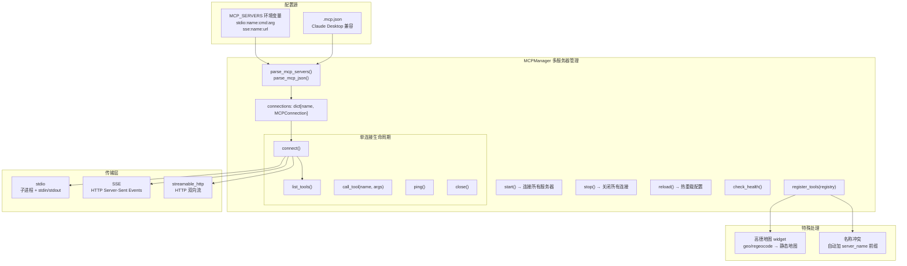

### 5.3 沙箱安全体系

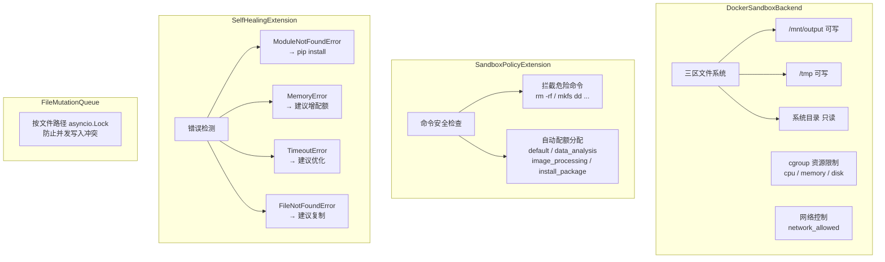

**设计意图：** 工具系统的设计核心是**统一异构工具源**——无论工具来自本地文件系统、远程 AI API、MCP 协议还是 HTTP 模板，对 LLM 而言都是同一个工具列表。

**Tool Protocol 的设计：** 工具只需实现 `definition`（返回名称、描述、JSON Schema 参数）和 `execute`（执行并返回 ToolResult）两个接口。用 Protocol 而非继承，是因为不同工具源的实现差异巨大（本地工具操作文件系统，MCP 工具通过子进程通信，AI 工具调用远程 API），强制继承同一个基类会导致无意义的空方法。

**MCP 集成的复杂性处理：** MCP 协议支持三种传输（stdio/sse/streamable_http），每种的生命周期管理不同。stdio 需要管理子进程、消费 stderr 防止死锁；SSE 需要维护长连接。MCPManager 统一管理多服务器，支持热重载 `.mcp.json`，名称冲突时自动加 server_name 前缀确保唯一性。

**沙箱三层防护的设计考量：**
- DockerSandboxBackend 提供**物理隔离**：三区文件系统（输出可写、临时可写、系统只读）+ cgroup 资源限制
- SandboxPolicyExtension 提供**策略拦截**：执行前检查命令安全性，根据命令类型自动分配资源配额
- SelfHealingExtension 提供**容错恢复**：ModuleNotFoundError 自动 pip install，TimeoutError 建议优化
- FileMutationQueue 提供**并发安全**：按文件路径加 asyncio.Lock，防止并行工具写入同一文件导致冲突

---

## 六、技能系统 (Skill System)

### 6.1 技能加载与使用流程

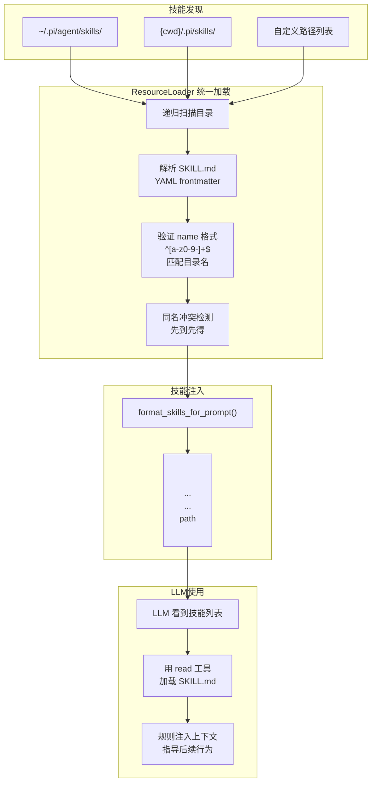

### 6.2 技能进化闭环

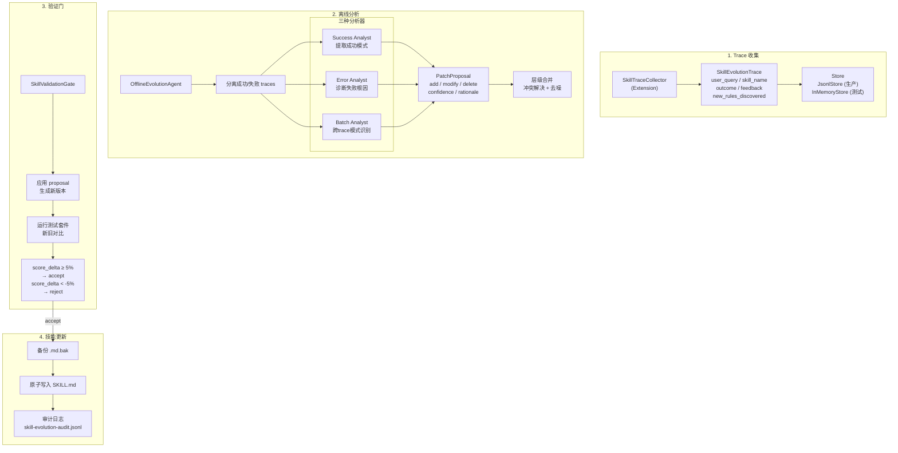

### 6.3 进化数据流

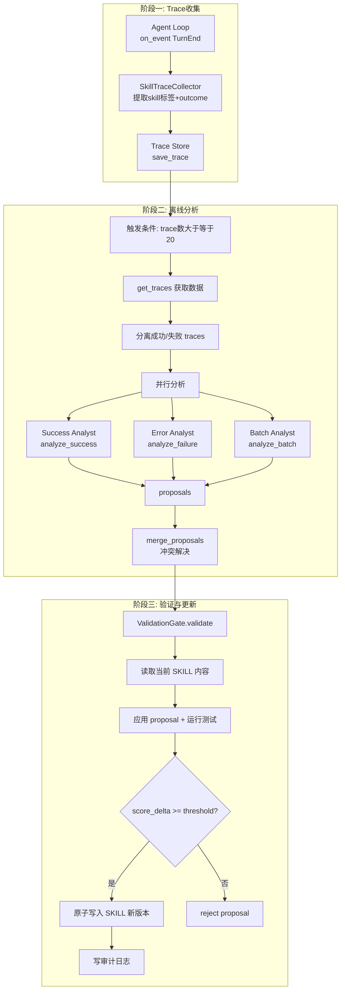

**设计意图：** 技能系统的核心理念是**让 LLM 自己决定何时使用技能**，而非硬编码的技能调度逻辑。

**为什么用 SKILL.md 而不是代码注册？** 技能本质是「提示词规则集」而非代码。将规则写在 Markdown 文件中，通过 XML 标签注入 system_prompt，LLM 看到技能描述后自主决定是否用 `read` 工具加载详细规则。这实现了技能的**热插拔**——添加新技能只需放置文件，无需重启服务或修改代码。

**技能进化闭环的设计考量：** 这是一个完整的**自我优化循环**——执行时自动收集 Trace，离线分析提取模式，验证门控确保改进有效后才应用。三种分析器并行工作：Success Analyst 提取可复用的成功模式，Error Analyst 诊断失败根因，Batch Analyst 跨多个 Trace 识别共性模式。层级合并解决多个分析器可能对同一规则提出冲突修改的问题。验证门控通过 A/B 测试（新旧版本跑同样测试集）确保改进是真实的，而非随机的参数变化。

---

## 七、多智能体系统 — Companion 伴侣宠物

### 7.1 Companion 四层架构

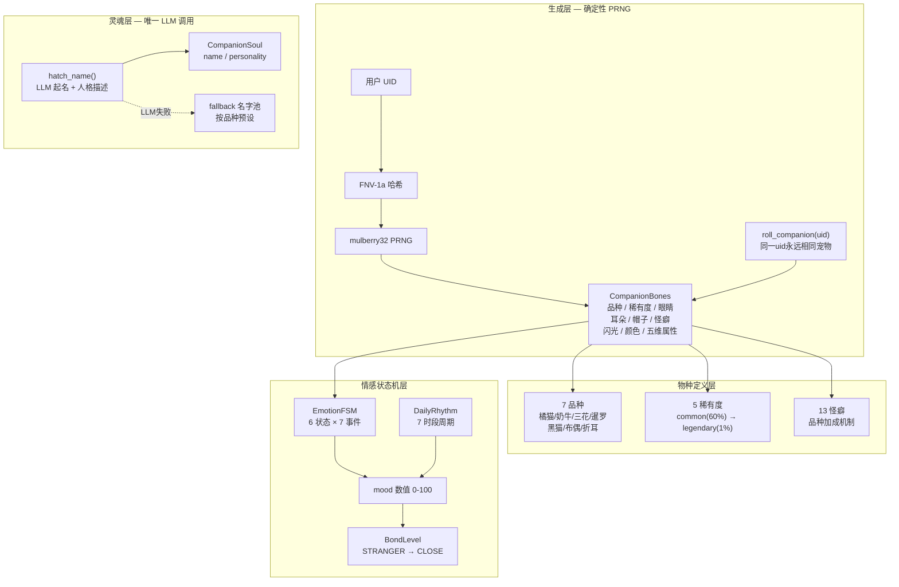

### 7.2 情感状态机转移图

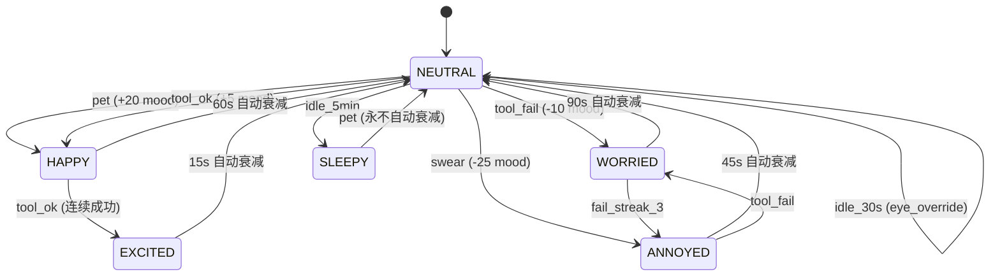

### 7.3 Companion 事件处理流程

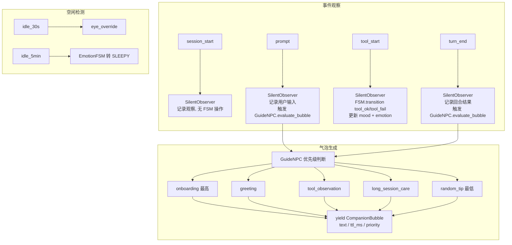

**设计意图：** Companion 不是传统意义上的「多智能体协作」，而是一个**确定性的虚拟宠物系统**，通过情感反馈增强用户与 Agent 的互动体验。

**为什么用确定性 PRNG 而不是随机生成？** 同一个 UID 必须永远生成相同的宠物属性（品种、怪癖、颜色等），否则用户每次刷新看到不同的宠物会失去归属感。FNV-1a 哈希 + mulberry32 PRNG 组合实现了这一点，且采用 append-only 的 roll 顺序保证老用户的属性序列不会被新属性破坏。

**情感 FSM 而非神经网络的原因：** 情感状态必须是**可预测、可调试、可控制**的。FSM 的 6 个状态和 7 种转移事件完全透明，开发者可以精确理解「为什么宠物现在不开心」。用神经网络则无法解释情感变化的原因，也无法保证在边缘情况下的行为可预测。

**SilentObserver 的设计考量：** 它只观察 Agent 事件、写入 CompanionMemory，**绝不中断 Agent 流程**。这是关键——宠物系统是附加体验，不能影响核心 Agent 的可靠性和响应速度。GuideNPC 是纯规则引擎，按优先级决定显示什么气泡，不使用 LLM 调用，保证零延迟。

---

## 八、Provider 系统

### 8.1 统一流式事件模型

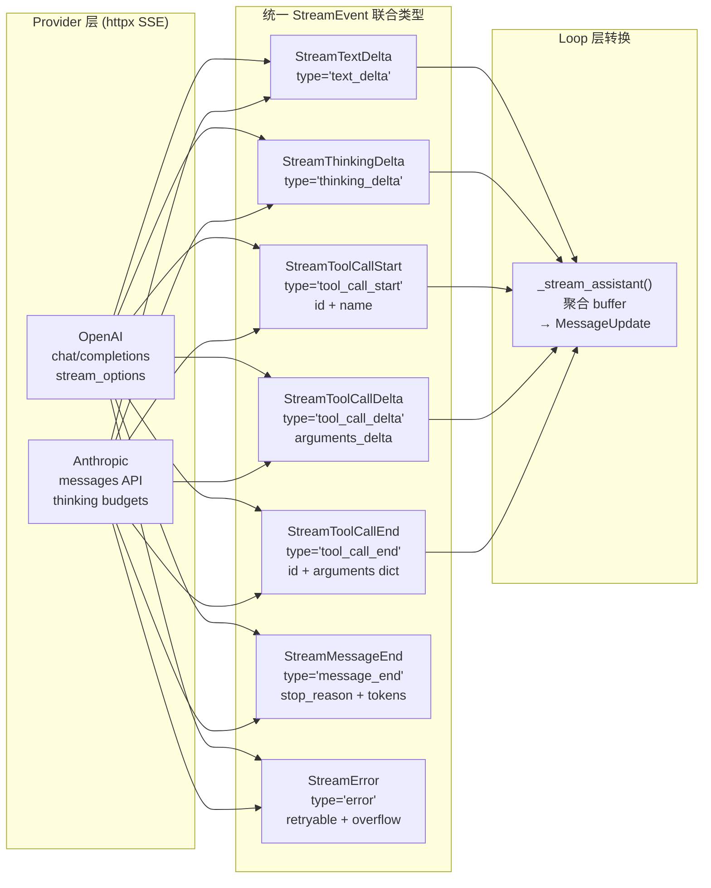

### 8.2 消息转换双路径

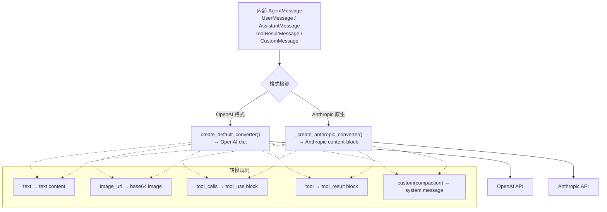

**设计意图：** Provider 层的设计目标是**让核心循环不感知具体 LLM API 的差异**。

**统一 StreamEvent 联合类型的必要性：** OpenAI 和 Anthropic 的 SSE 事件格式完全不同——OpenAI 用 `delta.content` 和 `delta.tool_calls[]`，Anthropic 用 `content_block_start/delta`。如果让 loop 层直接处理这两种格式，代码会充满 `if provider == "openai"` 的分支。统一为 7 种 StreamEvent 后，loop 层只需处理一套事件类型，新增 Provider 只需写一个适配器。

**消息转换双路径的原因：** Anthropic 的消息格式比 OpenAI 更复杂（支持 content block、thinking block 等原生特性）。如果统一转为 OpenAI 格式再转回 Anthropic 格式，会丢失原生特性（如 thinking budgets）。所以采用双路径：检测到已是 Anthropic 原生格式时走专用转换器，保留全部原生能力；OpenAI 格式走默认转换器。

**AuthSource 的三种策略：** static（硬编码 API Key，开发用）、env（环境变量，生产用）、dynamic（异步回调，多租户场景用，可从数据库/远程服务获取凭证）。这样不同部署场景无需修改代码。

---

## 九、会话与记忆系统

### 9.1 会话生命周期

```mermaid
graph TB
    subgraph 创建
        NEW["AgentSession.start()"]
        LOAD["加载已有会话<br/>_restore_messages()"]
        CREATE["创建新会话<br/>SessionHeader"]
        NEW --> LOAD
        NEW --> CREATE
    end

    subgraph 运行
        SUBSCRIBE["subscribe(agent events)"]
        EXT_INIT["初始化 ExtensionRunner<br/>注册 hook"]
        COMPACT_INIT["连接 Compactor<br/>overflow 回调"]
    end

    subgraph 事件持久化
        EVT_MSG["MessageEnd<br/>→ 持久化消息"]
        EVT_TOOL["ToolExecutionEnd<br/>→ 持久化工具结果"]
        EVT_END["AgentEnd<br/>→ 阈值压缩检查"]
    end

    subgraph 自动压缩
        THRESHOLD["消息数 × avg_tokens<br/>≥ context_window × 0.8"]
        OVERFLOW["Provider overflow 错误"]
        COMPACT["LLMSummaryCompactor<br/>保留最近 N 条<br/>历史 → LLM 总结"]
        SUMMARY["CustomMessage<br/>(compaction_summary)<br/>插入消息头部"]

        THRESHOLD --> COMPACT
        OVERFLOW --> COMPACT
        COMPACT --> SUMMARY
    end

    subgraph 存储
        JSONL["JsonlStore<br/>每会话一个 .jsonl<br/>append-only"]
        MEM["InMemoryStore<br/>测试/临时"]
    end

    NEW --> SUBSCRIBE --> EXT_INIT --> COMPACT_INIT
    COMPACT_INIT --> EVT_MSG & EVT_TOOL & EVT_END
    EVT_END --> THRESHOLD
    EVT_MSG & EVT_TOOL --> JSONL & MEM
```

### 9.2 记忆系统检索注入流程

```mermaid
graph TB
    subgraph 检索注入阶段 - 每次LLM调用前
        TRIGGER["Agent Loop<br/>transform_context"] --> EXTRACT["MemoryExtension<br/>提取最新用户文本"]
        EXTRACT --> RECALL["MemoryStore.recall(query, top_k)"]

        RECALL --> ADAPTER{"适配器类型"}
        ADAPTER -->|InMemory| IM["token-overlap 排序<br/>正则分词 + 交集计算"]
        ADAPTER -->|Mem0| M0["mem0.search<br/>向量语义检索"]
        ADAPTER -->|OpenViking| OV["viking.find<br/>图谱检索"]

        IM & M0 & OV --> RECORDS["MemoryRecord 列表"]
        RECORDS --> FORMAT["格式化为 system message"]
        FORMAT --> INJECT["inject_system_message_at_latest_user"]
        INJECT --> LLM_CALL["LLM.stream<br/>携带记忆上下文"]
    end

    subgraph 存储阶段 - TurnEnd时批量
        TURN_END["on_event TurnEnd"] --> REMEMBER["MemoryStore.remember<br/>session_id, pending_texts"]
    end
```

**设计意图：** 会话和记忆是两个独立的关注点，但在 AgentSession 中组合协作。

**为什么用 JSONL 而不是 SQLite？** JSONL 的 append-only 写入模式非常适合 Agent 会话的场景——每产生一个事件就追加一行，无需事务、无需锁竞争。读取时按行解析也很简单。SQLite 虽然查询能力强，但引入了事务、连接池等复杂性，对会话存储这种「写入频繁、查询简单」的场景是过度设计。

**自动压缩的双触发机制：** 阈值压缩（消息接近上下文窗口 80% 时主动触发）和溢出压缩（Provider 返回 overflow 错误时被动触发）互为补充。阈值压缩避免走到 Provider 限制，溢出压缩处理估算不准的情况。压缩策略是保留最近 N 条消息 + LLM 总结历史，以 `CustomMessage(compaction_summary)` 插入消息头部，让 LLM 知道历史被压缩过。

**记忆系统的检索注入设计：** MemoryExtension 同时实现 `on_event`（存储）和 `transform_context`（检索）两个钩子。存储是批量的（TurnEnd 时一次性写入 pending 队列），避免每条消息都触发写入开销。检索是每次 LLM 调用前自动执行，将相关记忆作为 system message 注入到最新用户消息之前，这样 LLM 能看到历史上下文但不会混淆记忆和当前对话。

---

## 十、场景层架构

### 10.1 场景适配模式

```mermaid
graph TB
    subgraph 共享核心
        CA["ChatAssistant<br/>Agent + Session + Tools + Skills"]
        SM["SessionManager<br/>实例池管理"]
        SPB["SystemPromptBuilder<br/>系统提示构建"]
        RL["ResourceLoader<br/>资源统一加载"]
    end

    subgraph CLI["CLI 场景"]
        CLI_IN["argparse + asyncio REPL"]
        CLI_OUT["ANSI 彩色输出<br/>think 块隔离"]
    end

    subgraph HTTP["HTTP SSE 场景"]
        API["FastAPI Router<br/>POST /chat/stream<br/>POST /human-input<br/>GET/DELETE /session<br/>知识库/连接器/Persona CRUD"]
        SSE["StreamingResponse<br/>text_delta / thinking_delta<br/>tool_start/update/end<br/>human_input_required"]
    end

    subgraph H5_SCENE["H5 场景"]
        H5_API["增强 v1 协议<br/>content block 生命周期<br/>多频道事件"]
        H5_TRACK["_ContentTracker<br/>start → delta×N → done"]
        H5_INPUT["多模态输入<br/>text/image/audio/video/file"]
    end

    subgraph FEISHU["飞书场景"]
        MULTI["多租户架构<br/>每 channel 独立 WS"]
        DEDUP["消息去重<br/>24h TTL + 持久化"]
        BATCH["批处理<br/>0.6s 延迟合并"]
        FORMAT["智能格式<br/>text / post / card"]
        HOTRELOAD["配置热重载<br/>30s 检查 channels.json"]
    end

    CA --> CLI & HTTP & H5_SCENE & FEISHU
    SM --> CLI & HTTP & H5_SCENE & FEISHU
    SPB --> CA
    RL --> CA
```

**设计意图：** 场景层是典型的**适配器模式**，每个场景只负责协议翻译，不重复实现业务逻辑。

**为什么每个场景都有自己的 ChatAssistant？** 因为不同场景对 Agent 的组装方式不同——CLI 场景只需基本工具，HTTP SSE 场景需要知识库和 Connector，H5 场景需要多模态输入支持，飞书场景需要消息去重和批处理。如果用一个统一的 ChatAssistant，会充满 `if scene == "h5"` 的分支。每个场景有独立的 ChatAssistant，但共享同一个 Agent 核心。

**飞书场景的特殊设计：** 多租户架构（一个进程多个 Bot）、消息去重（24h TTL 持久化到 JSON，防止飞书重试导致重复响应）、批处理（0.6s 延迟合并用户连续发送的消息）、配置热重载（30s 检查 channels.json 变更，自动启停 Bot）。

**H5 场景的增强协议：** 引入 `_ContentTracker` 跟踪 content block 生命周期（start/delta/done），事件分频道（heart/message/content/action/state/companion），支持多模态输入。这是对基础 SSE 协议的增强，适配移动端复杂的 UI 渲染需求。

---

## 十一、核心数据结构关系

```mermaid
graph TB
    subgraph 消息体系
        UM["UserMessage<br/>role='user'<br/>content: [TextContent | ImageContent]"]
        AM["AssistantMessage<br/>role='assistant'<br/>content: [TextContent | ToolCallContent]<br/>usage / stop_reason"]
        TRM["ToolResultMessage<br/>role='tool_result'<br/>tool_call_id / tool_name<br/>is_error"]
        CM["CustomMessage<br/>role='custom'<br/>custom_type / display"]
    end

    subgraph 内容块
        TC["TextContent<br/>type='text'"]
        IC["ImageContent<br/>type='image'<br/>data + mime_type"]
        TCC["ToolCallContent<br/>type='tool_call'<br/>id + name + arguments"]
    end

    subgraph 事件流
        AS["AgentStart"]
        AE["AgentEnd<br/>messages[]"]
        TS["TurnStart"]
        TE["TurnEnd<br/>message + tool_results"]
        MS["MessageStart"]
        MU["MessageUpdate<br/>delta: MessageDelta"]
        ME["MessageEnd"]
        TES["ToolExecutionStart"]
        TEU["ToolExecutionUpdate"]
        TEE["ToolExecutionEnd<br/>result + is_error"]
        HI["HumanInputRequired<br/>prompt + input_schema"]
    end

    subgraph 运行时状态
        STATE["AgentState<br/>system_prompt / model<br/>thinking_level / tools<br/>messages / is_streaming"]
        CTX["AgentContext<br/>system_prompt<br/>messages / tools"]
        CFG["AgentLoopConfig<br/>所有 hook / 策略 / 参数"]
    end

    UM --> TC & IC
    AM --> TC & TCC
    TRM --> TC & IC

    AS --> TS --> MS --> MU --> ME --> TE --> AE
    TE --> TES --> TEU --> TEE
    TE --> HI

    STATE --> CTX
    CTX --> CFG
```

**设计意图：** 数据结构的设计贯穿「不可变性 + 类型安全」两个原则。

**消息体系为什么用四种角色而不是统一的 Message？** 因为不同角色的消息有不同的内容约束——UserMessage 只能包含文本和图片（用户不能发起工具调用），AssistantMessage 可以包含文本和工具调用，ToolResultMessage 必须关联一个 tool_call_id。如果用统一 Message，这些约束只能在运行时检查，而用 Discriminated Union 可以在类型层面保证正确性。

**事件流的三阶段生命周期：** 每种实体（Message、ToolExecution）都遵循 Start/Update/End 三阶段。Start 携带轻量元数据（id、name），Update 携带增量数据（delta），End 携带完整结果。这让前端可以逐步渲染而无需等待全部完成。

**AgentState 与 AgentContext/AgentLoopConfig 的分离：** AgentState 是可变的状态容器（消息历史会增长、工具列表会变化），而 AgentContext 是每轮循环的快照，AgentLoopConfig 是不可变的配置。这样 loop 函数拿到的都是不可变输入，避免了并发修改导致的状态不一致。

---

## 十二、知识库与检索系统

```mermaid
graph TB
    subgraph 知识库 LocalKnowledgeBase
        ADD["add(document)<br/>分块 + embedding"]
        CHUNK["分块策略<br/>双换行分段<br/>句子拆分<br/>滑动窗口 500字/80字重叠"]
        EMB["sentence-transformers<br/>all-MiniLM-L6-v2<br/>懒加载 + 线程安全单例"]
        STORE_FS["文件系统存储<br/>meta.json + content.txt<br/>chunk_NNN.txt + chunk_NNN.npy"]
    end

    subgraph 检索
        QUERY["Query(text, top_k, filters)"]
        COSINE["余弦相似度<br/>归一化向量点积"]
        THRESHOLD["阈值过滤<br/>score < 0.2 丢弃"]
        RESULT["RetrievedChunk<br/>text / score / source"]
    end

    subgraph 集成方式
        TOOL["RetrieverTool<br/>包装为 LLM 工具"]
        AUTO["AutoRetrievalExtension<br/>每次调用前自动检索"]
    end

    ADD --> CHUNK --> EMB --> STORE_FS
    QUERY --> COSINE --> THRESHOLD --> RESULT
    RESULT --> TOOL & AUTO
```

**设计意图：** 知识库系统提供**长期记忆能力**，与 Memory 系统互补——Memory 记录对话历史，知识库存储结构化文档。

**为什么用文件系统而不是向量数据库？** 当前规模下（单用户/单项目的知识库），文件系统已经足够。每个文档一个子目录，chunk 文本和 embedding 向量并列存储，无需额外的数据库服务。如果未来规模增长，只需替换 Retriever 的实现，上层接口不变。

**分块策略的设计考量：** 先按双换行分段落保留语义边界，再用滑动窗口（500字/80字重叠）合并短段落。重叠是为了确保跨 chunk 的上下文不丢失。embedding 模型使用 `all-MiniLM-L6-v2`（轻量级、多语言支持），懒加载单例避免重复初始化。

**两种集成方式：** RetrieverTool 将检索包装为 LLM 可调用的工具（LLM 主动检索），AutoRetrievalExtension 每次 LLM 调用前自动检索并注入结果（被动检索）。前者适合精确查询，后者适合背景知识补充。

---

## 十三、Prompt 构建系统

```mermaid
graph TB
    SPB["SystemPromptBuilder"] --> S1["① Base Prompt<br/>默认提示 / 自定义 / Persona"]
    SPB --> S2["② Tools<br/>ToolDefinition → extract_snippet()"]
    SPB --> S3["③ Guidelines<br/>基于活跃工具名动态生成<br/>lambda 规则链"]
    SPB --> S4["④ Tool Guidelines<br/>全局指南 + 每工具 prompt_guidelines"]
    SPB --> S5["⑤ Context Files<br/>AGENTS.md / CLAUDE.md<br/>从 cwd 向上遍历"]
    SPB --> S6["⑥ Skills<br/><available_skills> XML"]
    SPB --> S7["⑦ Meta<br/>当前日期 + 工作目录"]

    S1 & S2 & S3 & S4 & S5 & S6 & S7 --> RESULT["SystemPrompt<br/>text / sections[]<br/>tool_count / skill_count"]
```

**设计意图：** Prompt 构建采用**分段组装**模式，每个 Section 独立生成、可追踪来源。

**为什么不用模板引擎（如 Jinja2）？** 因为 system_prompt 的内容高度依赖运行时状态（当前活跃工具列表、已加载技能、项目上下文文件），这些不是简单的变量替换，而是需要动态计算（如 Guidelines 基于工具名集合的条件规则）。分段组装比模板更灵活，每段可以有自己的生成逻辑。

**Guidelines 的 lambda 规则链设计：** 基于当前活跃工具名集合动态生成使用规则。例如检测到 grep/find/ls 同时存在时，添加「搜索优先用 grep/find/ls」的规则。这是条件性的——只在特定工具组合出现时才生效，避免了固定模板无法适应不同工具配置的问题。

**Context Files 的向上遍历策略：** 从 cwd 向上遍历收集 AGENTS.md/CLAUDE.md，遇到 `.git` 停止。这样项目根目录的配置文件会被自动发现，而父目录的配置不会意外覆盖。这是 Git 仓库常见的配置发现模式。

---

## 十四、系统关键设计模式总结

| 模式 | 应用位置 | 说明 |
|------|---------|------|
| **Async Generator Pipeline** | `agent_loop()`, `execute_tools()` | 通过 `yield` 流式产出事件，生产者-消费者解耦 |
| **Discriminated Union** | `AgentMessage`, `AgentEvent`, `StreamEvent` | Pydantic `Annotated[Union]` 类型安全联合类型 |
| **Hook Chain (中间件)** | Agent Hook 链, ExtensionRunner | 链式传递，支持短路/修改/注入 |
| **Strategy Pattern** | `AgentLoopConfig` | 注入 `stream_fn`/`convert_to_llm`/`transform_context` 策略函数 |
| **Observer Pattern** | `Agent.subscribe()` | 事件广播给所有 listener，返回取消订阅函数 |
| **Protocol (鸭子类型)** | `Tool`, `ModelProvider`, `SessionStore`, `MemoryStore`, `Retriever` | 结构化子类型，无需显式继承 |
| **Registry Pattern** | `ToolRegistry`, `ModelRegistry` | 集中注册、按名发现 |
| **Adapter Pattern** | `MCPToolAdapter`, `HttpTool`, Provider 转换层 | 统一异构外部接口 |
| **FSM (有限状态机)** | `EmotionFSM` | 确定性状态转移 + 自动衰减 |
| **Circuit Breaker** | 重试机制 + overflow 恢复 | exponential backoff + compact_callback |
| **HITL (Human-in-the-Loop)** | `HumanInputGate` | `asyncio.Future` 异步暂停/恢复 |
