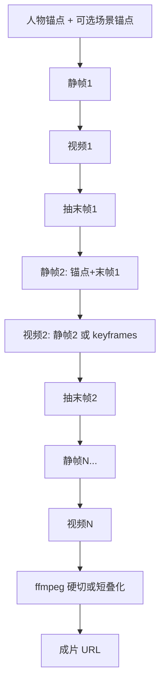

# 短剧流水线连贯性与体验优化计划

> 日期：2026-07-31  
> 状态：P0–P3 已落地（不含 BGM、后台任务）；方案 C 桥接  
> 前置文档：[docs/short-drama-pipeline-plan.md](short-drama-pipeline-plan.md)（v1 已落地）  
> 范围：在既有 `create_short_drama` 之上提升镜间连贯、人物/场景一致、成片观感与可维护性  
> 非目标（本迭代仍不做）：ChatCut 时间线、人工逐步审片、配乐/字幕/TTS（可列为 P3 可选项）

---

## 1. 背景与问题

### 1.1 现状链路

```text
人物锚点 → 每镜独立静帧（可并行）→ 每镜独立图生视频 → ffmpeg 硬切拼接 → 成片
```

核心实现：

- 编排：[`agent_core/tools/short_drama_pipeline.py`](../agent_core/tools/short_drama_pipeline.py)
- Agnes 调用：[`agent_core/tools/agnes_client.py`](../agent_core/tools/agnes_client.py)
- 拼接：[`agent_core/tools/video_concat_tool.py`](../agent_core/tools/video_concat_tool.py)

### 1.2 用户感知问题

分镜之间连贯性差，多段视频拼接后无法顺畅连接。观感像「多条独立短视频硬切」，而非同一叙事镜头语言。

### 1.3 根因（按影响排序）

| # | 根因 | 说明 |
|---|------|------|
| R1 | **无跨镜状态传递** | 静帧/视频彼此独立，不引用上一镜末帧或静帧 |
| R2 | **静帧可并行** | ≤3 并行放大场景/姿态/光线漂移 |
| R3 | **分镜契约过薄** | 仅 `still_prompt` / `motion_prompt`，无承接、转场、结束姿态字段 |
| R4 | **拼接为硬切** | `ffmpeg concat` 无叠化；stream copy 遇编码不一致时切点可能花屏 |
| R5 | **场景无锚点** | 仅人物锚点，背景/风格跨镜易漂 |
| R6 | **失败整单作废** | 不能单镜重跑再拼，迭代成本高 |

**结论：** 「接不上」首先是生成阶段问题，其次才是拼接参数。优先做跨镜桥接，再补转场与体验。

---

## 2. 优化目标

### 2.1 成功标准（可验收）

1. **镜间视觉连续**：相邻镜在人物姿态/场景方向上可感知承接（抽样主观评分优于 v1）。
2. **拼接观感**：切点无明显跳闪；可选短叠化时不花屏、不音轨爆点。
3. **契约可测**：分镜结构含连贯字段；关键路径有单元/集成测试（mock Agnes）。
4. **可局部重跑**（P2）：指定 `shot_id` 重生成后可复用其余镜成片。

### 2.2 约束（延续 v1）

- 交付载体仍为 agent-core / H5，全自动跑完（HITL 仅补锚点）。
- 用户上传图为人物身份唯一锚点来源。
- 默认 9:16、≤8 镜、~5s/镜；拼接仍以本地 ffmpeg 为主。
- 不改 `loop.py`；编排放在工具层。

---

## 3. 目标架构（优化后）



关键变化：

1. 静帧 **串行**，每镜参考「人物锚点 + 上一镜静帧/末帧」。
2. 视频优先 **桥接条件**（末帧 / keyframes / first-last，以 Agnes 实际能力为准）。
3. 拼接可选 **短 crossfade** + 必要时统一转码。

---

## 4. 分阶段执行计划

### P0 — 跨镜桥接（最高优先级）

**目标：** 消除「每镜重新起势」的主因。

#### P0.1 视频末帧抽取

- 新增工具函数（建议放 `agent_core/tools/media_utils.py` 或 `video_frame.py`）：
  - 输入：本地/远端视频路径或 URL
  - 输出：末帧图片落盘（`.pi/uploads/` 或 `.pi/renders/`）+ 公网/远端 URL（复用现有 `MIGU_UPLOAD_URL` 上传，保证 Agnes 可拉）
- 实现：`ffmpeg -sseof -0.1 -i ... -frames:v 1`（或等价）
- 测试：用本地短 mp4 断言输出文件非空

#### P0.2 静帧串行 + 链式参考

- 修改 `create_short_drama`：
  - 去掉静帧 `asyncio.gather` 并行（或改为可选；默认串行）
  - 镜 1：参考 = 人物锚点（+ 可选场景锚点）
  - 镜 N（N>1）：参考 = 人物锚点 + **上一镜末帧**（优先）或上一镜静帧
- Prompt 模板追加固定衔接语，例如：
  - 「承接上一画面，同一角色与场景连续，禁止跳切到无关场景」
- 更新 Plan 步骤文案：可标「静帧 N（承接末帧 N-1）」

#### P0.3 视频生成桥接（能力探测后定案）

按 Agnes 实际支持选型（Phase 0 探针写进开发日志）：

| 方案 | 条件 | 做法 |
|------|------|------|
| A. keyframes | `mode=keyframes` + 多图可用 | 首帧=本镜静帧，末帧意图用下一镜静帧或本镜目标姿态图 |
| B. 末帧作下一镜 image | i2v 仅单图 | 镜 N+1 的 `image` 用镜 N 末帧，静帧作参考图之一 |
| C. 仅静帧链 | 视频 API 无跨帧 | 至少保证静帧链连续，视频仍单图 i2v |

**P0 验收：**

- [x] 2 镜样例：第二镜静帧可看出承接第一镜场景/姿态（串行 + 末帧参考）
- [x] mock 测试覆盖「末帧路径传入下一镜 `input_images`」
- [x] 文档注明选用的 Agnes 桥接方案（**C**：静帧链 + 单图 i2v）

**预估：** 2–3 人日（含探针）

---

### P1 — 分镜契约与 Prompt 规范

**目标：** 让 LLM 拆镜时就携带连贯信息，减少生成侧随机跳跃。

#### P1.1 扩展 `shots[]` schema

在现有字段上增量（向后兼容：缺省时按 hard_cut + 无承接处理）：

```json
{
  "id": "s2",
  "order": 2,
  "character_ids": ["heroine"],
  "still_prompt": "...",
  "motion_prompt": "...",
  "continues_from": "s1",
  "transition": "match_cut",
  "end_pose": "面向右侧，迈出右脚",
  "camera": "medium shot, slow push-in",
  "scene_id": "bus_stop_night"
}
```

| 字段 | 含义 | 流水线用法 |
|------|------|------------|
| `continues_from` | 上一镜 id | 决定是否注入末帧参考 |
| `transition` | `hard_cut` / `match_cut` / `dissolve` | 影响拼接策略与 motion prompt |
| `end_pose` | 本镜结束姿态 | 写入 motion_prompt；供下一镜 still 引用 |
| `camera` | 景别/运镜 | 约束运动幅度，避免每镜乱切 |
| `scene_id` | 场景标识 | 同 scene 强制场景锚点 |

#### P1.2 Prompt / guidelines 更新

- `create_short_drama` 的 `prompt_guidelines`：要求拆镜时填写 `continues_from` / `end_pose` / `camera`
- 工具内组装 still/motion prompt 时注入 `end_pose`、`continues_from` 文案
- 可选：极薄 Skill（仅路由与填参规范，**不**承担执行）

#### P1.3 分镜校验

- 镜头数 ≤8；`continues_from` 指向存在的上一镜
- 同 `scene_id` 连续镜提醒模型勿无故换场

**P1 验收：**

- [x] schema + 归一化函数单测
- [x] 缺省字段时行为与 v1 兼容（transition 默认 hard_cut）
- [x] 开发日志记录实现摘要

**预估：** 1–2 人日

---

### P2 — 拼接观感与单镜重跑

#### P2.1 拼接增强

- `concat_videos` 增加参数：
  - `transition`: `none` | `crossfade`
  - `crossfade_seconds`: 默认 `0.25`（仅 dissolve/match 需要时启用）
- `crossfade` 路径：统一转码（libx264 + aac）再 xfade / acrossfade，避免混编码硬切花屏
- `hard_cut`：保持现有 concat demuxer；失败则回退转码再拼

#### P2.2 单镜重跑（降低迭代成本）

- 新工具或扩展参数，例如：
  - `create_short_drama` 增加可选 `resume_from_details` / `rerun_shot_ids`
  - 或 `rerun_short_drama_shot(session_artifact_id, shot_id)`
- 持久化中间产物摘要（已有 `details.shots`）：静帧 URL、视频 URL、末帧 URL
- 重跑后仅替换指定镜，再 concat

**P2 验收：**

- [x] crossfade 路径实现（`concat_video_files_crossfade`）
- [x] 重跑第 2 镜不重新生成第 1 镜（mock 断言调用次数）

**预估：** 2–3 人日

---

### P3 — 一致性与体验（可选增强）

| 项 | 做法 | 状态 |
|----|------|------|
| 场景锚点 | `scenes[]` + HITL/上传；同 `scene_id` 强制参考 | ✅ 已落地 |
| 风格锁 | 同一短剧共用 `style_preamble` | ✅ 已落地 |
| 多角色站位 | `character_positions` + LEFT/RIGHT 文案 | ✅ 已落地 |
| 成片音频 | 统一静音（`-an`） | ✅ 已落地 |
| 成片 BGM | 叠一条 BGM | ⏸ 暂不实现 |
| 后台任务 | 长耗时 submit + poll | ⏸ 暂不实现 |

**预估：** 按需拆分，单独立项

---

## 5. 建议改动文件清单

| 阶段 | 文件 | 变更类型 |
|------|------|----------|
| P0 | `agent_core/tools/video_frame.py`（新） | 抽帧 |
| P0 | `agent_core/tools/short_drama_pipeline.py` | 串行静帧、注入末帧参考、Plan 文案 |
| P0 | `agent_core/tools/agnes_client.py` | 按需支持 keyframes / 多参考 |
| P0 | `tests/tools/test_short_drama_pipeline.py` 等 | 桥接路径测试 |
| P1 | `short_drama_pipeline.py` schema + guidelines | 契约扩展 |
| P2 | `video_concat_tool.py` | crossfade / 转码策略 |
| P2 | 编排工具或新 `rerun_*` | 单镜重跑 |
| 文档 | 本文 + `short-drama-pipeline-plan.md` §已知限制 | 交叉引用 |

---

## 6. 风险与探针

1. **Agnes 是否支持真正的 first/last / keyframes 跨镜**  
   - P0 开工前用真实 key 跑通 1 次；结果写入 `docs/development-log/YYYY-MM-DD.md`  
   - 不支持则落地方案 B/C，不阻塞静帧链

2. **末帧上传耗时与配额**  
   - 每镜多一次抽帧 + 远端上传；需计入总时长与失败重试

3. **叠化与时长**  
   - xfade 会缩短总时长约 `(N-1)*crossfade`；产品文案需说明或补帧补偿（默认接受缩短）

4. **LLM 填参质量**  
   - 连贯字段可能漏填；工具侧必须有缺省与校验，不能假设模型总填对

---

## 7. 开发顺序与门禁

```text
探针（Agnes 桥接能力）
  → P0.1 抽末帧
  → P0.2 静帧串行+末帧参考
  → P0.3 视频桥接（按探针选型）
  → P1 分镜契约
  → P2 拼接叠化 + 单镜重跑
  → P3 按需
```

每阶段门禁：

1. 相关单测通过  
2. 至少 1 次 2–3 镜本地/联调样例（URL 记入开发日志）  
3. 更新本文「状态」与 `short-drama-pipeline-plan.md` §9 已知限制  

---

## 8. 与 v1 文档的关系

| 文档 | 职责 |
|------|------|
| [short-drama-pipeline-plan.md](short-drama-pipeline-plan.md) | v1 需求定稿与已实现基线 |
| **本文** | v1.1+ 连贯性与体验优化的执行指导 |

实现时以本文阶段任务为准；若与 v1 决策冲突（例如引入 BGM），需先更新需求决策表再编码。

---

## 9. 下一步（启动开发时）

1. 确认 P0 范围：是否包含视频 keyframes，或仅静帧链 + 末帧参考。  
2. 执行 Agnes 桥接探针，选定方案 A/B/C。  
3. 按 P0 → P1 → P2 开分支实现，每阶段小步提交。
