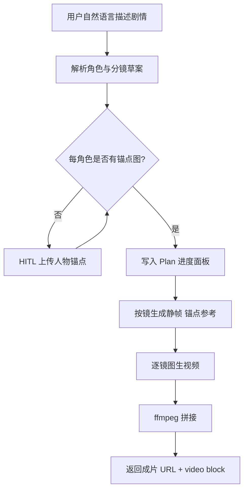

# 短剧流水线（图 → 视频 → 拼接成片）需求与执行计划

> 日期：2026-07-30  
> 状态：已落地（2026-07-30）  
> 范围：agent-core / scene（H5 为主，工具层可共用 http_sse）  
> 非目标：ChatCut、BGM/字幕/旁白、半自动人工审片

---

## 1. 需求定稿

### 1.1 一句话目标

用户用自然语言描述短剧剧情；若缺少人物锚点图则 HITL 补传；系统全自动完成「分镜静帧生成 → 每镜图生视频 → 本地 ffmpeg 拼接」，并在聊天中展示任务进度面板与最终成片下载。

### 1.2 已锁定决策

| # | 决策项 | 选择 | 含义 |
|---|--------|------|------|
| 1 | 交付载体 | A | 做在 agent-core（H5/对话工具），不做 ChatCut 主路径 |
| 2 | 自动化 | A | 一次启动后全自动跑完（锚点补齐后不再停） |
| 3 | 成片定义 | A | 仅多段视频首尾拼接，无 BGM / 字幕 / TTS |
| 4 | 输入 | A | 自然语言剧情描述 |
| 5 | 人物一致性 | C | **用户上传图为唯一身份锚点**，禁止另造角色脸 |
| 6 | 拼接落点 | A | 本机 ffmpeg concat，返回可下载 URL |
| 7 | 启动交互 | C | 文字先开跑；缺锚点 → HITL 补图 → 自动继续 |
| 8 | 画幅与规模 | 默认（见 §1.4） | v1 写死上限，避免配额失控 |
| 9 | 进度与交付 | 需要进度面板 | 多镜头批量必须可见；成片以 URL / video block 交付 |
| 10 | 文档位置 | `docs/` | 本文即开发指导文档 |

### 1.3 「一系列人物图片」的精确定义（一致性 C）

与「自由生成新角色」不同，v1 语义为：

1. **身份源**：仅用户上传的人物锚点图（可多角色，每角色至少 1 张）。
2. **分镜静帧**：按分镜列表，用锚点做参考（`generate_image` + `input_images`）生成**每镜关键帧/场景静帧**，保持脸与服装与锚点一致。
3. **禁止**：不根据纯文本「发明」角色长相；无锚点不得进入生图/生视频阶段。

### 1.4 v1 默认参数（问题 8「默认」落点）

| 参数 | v1 默认 | 说明 |
|------|---------|------|
| 画幅 | `9:16` 竖屏 | 短剧默认；用户 NL 明确要求横屏时可改为 `16:9` |
| 镜头数上限 | **8** | 超出则截断并在进度里说明 |
| 单镜时长 | **约 5s** | Agnes：`num_frames=121`，`frame_rate=24` |
| 分辨率（视频） | 竖屏约 `768×1152` | 与 Agnes 工具 width/height 对齐；横屏互换 |
| 并发生成 | 串行图生视频 | 先完成静帧批，再逐镜 i2v（便于进度与失败定位）；静帧可适度并行（≤3） |

后续若要放开上限/并行，单独开迭代，不进 v1。

### 1.5 入口与交付

- **入口**：H5 对话为主（已有 HITL `image_upload`、`PlanCard`、`/upload`）。工具注册到 `scene/h5/chat_assistant.py`；`http_sse` 同步注册同一流水线工具，桌面端可复用，但**进度面板 UI 优先落地 H5**。
- **交付**：会话内展示最终成片（video block + 可下载 URL）；过程用**任务进度面板**（复用/扩展现有 `plan.update` + `PlanCard`，见 §3.4）。
- **不另建**独立短剧 Web 应用或独立全局任务中心（v1）。

### 1.6 非目标（明确不做）

- ChatCut 时间线 / 导出
- 配乐、字幕、旁白、TTS
- 人工逐步审片（定妆确认、单镜确认）
- DAG 引擎 / 独立全局 Job 表（优先会话内状态 + 现有 Plan 机制）
- 无用户锚点时的「纯文生角色」短剧

---

## 2. 用户流程



### 2.1 触发语示例

- 「用我上传的角色做一条短剧：女孩在雨夜追公交车，最后上车微笑」
- 「根据这两张人设图拍 5 镜竖屏短剧：……」

模型应识别为短剧流水线意图，调用流水线工具（而非零散多次 `generate_video`）。

### 2.2 HITL（缺锚点）

复用现有 [`RequiresHumanInput`](agent_core/core/human_input.py) + H5 [`HitlCard`](scene/h5/static/src/components/hitl/HitlCard.tsx) `image_upload`：

- `prompt`：说明需要哪些角色的锚点（按解析出的角色名列出）
- `fields`：每个角色一个 `image_upload`（或一个多图字段 + 角色名映射），`required=true`
- 用户提交后，工具恢复执行，**不再二次确认**，直接全自动后续阶段

锚点图经现有 `/upload` 落盘，流水线内使用可访问 URL（`/uploads/...` 或 Agnes 可拉取的公网/可达 URL；若 Agnes 只能拉公网 URL，需在实现阶段解决本地上传可达性——见 §5 风险）。

---

## 3. 架构设计

### 3.1 原则

- **最小化 core 改动**：编排放在工具 / scene 层，不改 `loop.py`。
- **复用**：`generate_image` / `generate_video` 的 Agnes 调用逻辑；`manage_plan` / `PlanStore` 做进度；HITL 补锚点；`/upload` + `/uploads` 静态服务。
- **新增**：流水线编排工具 + ffmpeg 拼接工具（或编排工具内聚拼接）+ H5 进度展示补齐。

### 3.2 建议包布局

```
agent_core/tools/
  short_drama_pipeline.py   # 编排入口工具（主）
  video_concat_tool.py      # ffmpeg concat（可被编排调用，也可单用）
  agnes_image_tool.py       # 复用（静帧）
  agnes_video_tool.py       # 复用（图生视频 + 状态查询）

agent_core/planning/        # 已有：进度落盘与 SSE
scene/h5/...                # HITL、PlanCard、video block
```

可选：将「分镜解析」做成编排工具内部的一次 LLM 结构化输出，或依赖当前 turn 的模型在调用工具前填好 `shots`/`characters` 参数。v1 推荐：

- **工具参数接收结构化分镜**（characters + shots）
- **由对话模型负责**从 NL 抽出结构再调工具  
- 工具内校验：镜头数 ≤8、每角色有锚点；缺锚点则 HITL

避免在工具内再套一层 LLM（降复杂度）。

### 3.3 工具契约（草案）

#### `create_short_drama`（编排主工具）

**输入（概念字段）：**

```json
{
  "title": "雨夜追车",
  "aspect_ratio": "9:16",
  "characters": [
    {"id": "heroine", "name": "女孩", "anchor_urls": []}
  ],
  "shots": [
    {
      "id": "s1",
      "order": 1,
      "character_ids": ["heroine"],
      "still_prompt": "竖屏，雨夜公交站，女孩侧脸望向远方，电影感",
      "motion_prompt": "雨水下落，她向前迈一步，镜头缓推"
    }
  ]
}
```

**行为：**

1. 校验 shots ≤8；规范化画幅 → width/height/`num_frames`。
2. 若任一 `character` 的 `anchor_urls` 为空 → `RequiresHumanInput`。
3. `manage_plan` 等价更新：步骤 = 静帧×N + 视频×N + 拼接 + 完成。
4. 对每个 shot：用对应角色锚点调用图生图 → 得到 `still_url`。
5. 对每个 shot：`generate_video(image=still_url, prompt=motion_prompt, ...)`；未完成则内部轮询 / 复用 `check_video_status` 逻辑，直到全部完成或失败。
6. 调用 concat：输入有序视频 URL/本地路径 → 输出成片路径/URL。
7. 返回：成片 URL、各镜中间产物摘要、失败镜列表（若部分失败则 v1 **整单失败并保留已生成资产说明**，策略见 §3.5）。

#### `concat_videos`（拼接）

- 输入：有序 `video_urls` 或本地路径列表、`name`
- 实现：下载到临时目录 → ffmpeg concat demuxer（同编码尽量 stream copy，否则统一转码再拼）
- 输出：保存到 `.pi/uploads/`（或专用 `.pi/renders/`），经 `/uploads`（或新 mount）对外可访问
- 依赖：运行环境需安装 `ffmpeg`；缺失时工具返回明确错误

### 3.4 任务进度面板

复用已落地的 Plan-Execute（见 [`docs/superpowers/specs/2026-07-20-plan-execute-design.md`](superpowers/specs/2026-07-20-plan-execute-design.md)）：

| 能力 | 做法 |
|------|------|
| 步骤列表 | Plan steps：`解析/锚点` → `静帧 1..N` → `视频 1..N` → `拼接` → `完成` |
| SSE | 现有 `plan.update` |
| UI | H5 `PlanCard`；必要时在 step 下挂当前工具块（静帧缩略图 / 视频） |
| 补充 | 若 `tool_call.progress` 今日前端 no-op，流水线**以 Plan 步骤状态为主**，不强制新开进度协议 |

v1 验收标准：用户能看到「当前做到第几镜」「拼接中」「完成/失败」，无需刷聊天猜测。

### 3.5 失败与重试策略（v1）

| 场景 | 行为 |
|------|------|
| 缺锚点 | HITL，不计入失败 |
| 单镜静帧失败 | 最多自动重试 1 次；仍失败 → 整单失败，Plan 标失败步 |
| 单镜视频失败 / 超时 | 同静帧；超时阈值与现有 Agnes 轮询策略对齐并文档化（建议编排内长轮询，避免依赖用户喊 check） |
| ffmpeg 失败 | 整单失败，保留各镜视频 URL 供人工另用 |
| 部分成功 | v1 **不自动跳过坏镜拼接**；避免默默缺镜成片 |

（「跳过坏镜继续拼」可作为 v1.1，需产品再确认。）

---

## 4. 与现有代码的衔接点

| 模块 | 路径 | 用途 |
|------|------|------|
| 文生图/图生图 | `agent_core/tools/agnes_image_tool.py` | 分镜静帧 |
| 图生视频 | `agent_core/tools/agnes_video_tool.py` | 每镜 i2v |
| HITL | `agent_core/core/human_input.py` + H5 HitlCard | 补锚点 |
| 上传 | `scene/h5/server.py` `/upload`、`/uploads` | 锚点与成片托管 |
| Plan 进度 | `agent_core/planning/` + H5 PlanCard | 任务进度面板 |
| 注册 | `scene/h5/chat_assistant.py`（及 http_sse 对称注册） | 工具挂载 |
| 前端 video | `useSSE` / `chat-store` 对 `generate_video` 的重建逻辑 | 成片展示需扩展识别流水线工具名 |

---

## 5. 风险与待实现时验证项

1. **Agnes 是否能拉取本地 `/uploads` URL**  
   若不能，需在流水线内把锚点/静帧上传到 Agnes 可访问的存储，或改用 Agnes 支持的输入方式。开发第一步先用真实 key 做一次连通性探针。

2. **ffmpeg 部署**  
   Docker/本机需保证 `ffmpeg` 在 PATH；CI 可对 concat 单测用 mock 或 skip。

3. **长耗时与 SSE**  
   8 镜 ×（静帧 + 视频）可能数十分钟。编排工具必须持续上报 Plan 进度，避免被前端/代理空闲超时误杀；必要时拆「提交流水线任务 + 后台跑 + 查询」——**v1 优先同步编排 + 进度事件**；若实测超时，再升为后台 job（记为风险升级项，不提前过度设计）。

4. **模型是否稳定抽出分镜 JSON**  
   用 `prompt_guidelines` / skill 约束；加 1–2 个集成测试用 FakeProvider 脚本化工具参数。

5. **人物一致性上限**  
   C 依赖模型对参考图的遵循度；文档与产品话术写清「尽量一致，非像素级 lock」。

---

## 6. 执行计划（开发步骤）

### Phase 0 — 探针与脚手架（0.5–1d）

- [ ] 确认 `AGNES_API_KEY` 下：本地 upload URL / 公网 URL 图生图、图生视频均可用
- [ ] 本机与目标部署镜像确认 `ffmpeg -version`
- [ ] 定成片目录：`.pi/renders/` 或复用 `.pi/uploads/`

**验证：** 手工 curl/脚本各跑通 1 次。

### Phase 1 — `concat_videos` 工具（1d）

- [ ] 实现下载 → concat → 落盘 → 返回 URL
- [ ] 单测：假文件列表 + mock ffmpeg 或临时生成短片
- [ ] 注册到 H5 / http_sse

**验证：** 给定 2 个样例 mp4，工具返回可播放拼接结果。

### Phase 2 — `create_short_drama` 编排（2–3d）

- [ ] 参数 schema、校验、HITL 缺锚点
- [ ] 串起静帧（调用 Agnes image）→ 视频（Agnes video，内轮询）→ concat
- [ ] 接入 PlanStore / `manage_plan` 步骤更新
- [ ] `prompt_snippet` / guidelines：识别短剧意图只调此工具
- [ ] 单测：Fake/httpx mock 全路径；HITL 分支；超 8 镜截断

**验证：** 带 1 个角色锚点 + 2 镜的集成测试（可 mock 生成 API）跑通到「返回成片 URL」。

### Phase 3 — H5 进度面板与成片展示（1–2d）

- [ ] 确认 PlanCard 对流水线 steps 展示完整
- [ ] SSE / chat-store：识别流水线工具结果中的成片 URL，重建 video block
- [ ] HITL 多角色上传文案与字段可用
- [ ]（可选）步骤下展示静帧缩略图

**验证：** 浏览器走通「NL → HITL 补图 → 进度变化 → 成片可播」。

### Phase 4 — 打磨与文档收尾（0.5–1d）

- [ ] 失败文案、超时文案
- [ ] 更新 `docs/FEATURES.md` / changelog（提交时按仓库流程）
- [ ] 本文状态改为「已落地」，补「已知限制」

---

## 7. 验收标准（Definition of Done）

1. 用户仅发 NL、未带锚点时，出现 HITL 上传；提交后自动继续，无需再说「继续」。
2. 提供锚点后，全自动产出 ≤8 镜竖屏短剧拼接成片，聊天内可播/可下载。
3. 过程中 Plan/进度面板可见各阶段状态（静帧/视频/拼接）。
4. 无锚点时不会生成「新脸」角色定妆图作为身份源。
5. 无 ChatCut、无配乐字幕依赖；拼接仅 ffmpeg。
6. 关键路径有自动化测试；真机/本地至少 1 次 E2E 样例记录在开发日志。

---

## 8. 需求追溯（问答摘要）

- 交付：agent-core（A）
- 自动化：全自动（A）
- 成片：仅拼接（A）
- 输入：自然语言（A）
- 一致性：用户上传唯一锚点（C）
- 拼接：本地 ffmpeg + URL（A）
- 启动：缺锚点 HITL 后自动继续（C）
- 规模：9:16、≤8 镜、~5s/镜（默认）
- UI：要任务进度面板；文档在 `docs/`

---

## 9. 已知限制

- Agnes 需能访问锚点/静帧 URL；本地开发请配置 `PUBLIC_BASE_URL` 指向可访问的 H5 服务地址。
- 单条流水线同步执行，8 镜全链路可能耗时较长（工具 timeout 3600s）。
- 人物一致性依赖 Agnes 对参考图的遵循度，非像素级锁定。
- v1 任一镜头失败则整单失败，不自动跳过坏镜拼接。

## 10. 下一步

维护与迭代见 `agent_core/tools/short_drama_pipeline.py` 与关联测试。
