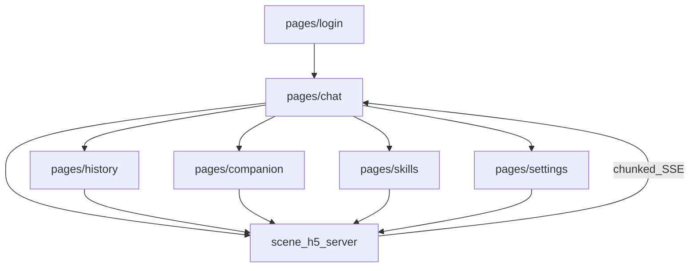

# H5 → 微信小程序（uni-app）迁移落地文档

> 用途：指导将现有 H5（`scene/h5`）整体功能整合到本目录微信小程序工程（`scene/wechat-uni-app`）。  
> 范围：仅前端重写；**复用** `scene/h5` 后端协议，不新造 API。  
> 更新：2026-07-28

---

## 1. 背景与目标

### 1.1 源与目标

| 角色 | 路径 | 现状 |
|------|------|------|
| **源（H5）** | `scene/h5/` | FastAPI 后端 + React/Zustand 前端；入口 `static/src/main.tsx` → `static/src/h5/App.tsx` |
| **目标（小程序）** | `scene/wechat-uni-app/` | Vue3 uni-app 空脚手架（HBuilderX 布局），仅默认 Hello 页；`manifest.json` 中 `vueVersion: "3"`，`mp-weixin.appid` 为空 |

说明：仓库中不存在 `scene/h5scene/`；本工程即迁移落点。

### 1.2 职责边界

```
┌─────────────────────┐     REST / SSE      ┌──────────────────────┐
│  wechat-uni-app     │ ──────────────────► │  scene/h5/server.py  │
│  (uni-app Vue3 MP)  │ ◄────────────────── │  PORT 默认 8000      │
└─────────────────────┘   chunked 流式事件   └──────────────────────┘
         ▲
         │  与 H5 共享同一套后端；H5 前端仍可独立运行
         │
┌─────────────────────┐
│  scene/h5/static    │  (React 参考实现，只读对照，不迁代码粘贴)
└─────────────────────┘
```

- **后端**：继续使用 `python -m scene.h5.server`（或等价部署），不在本阶段改造。
- **前端**：用 uni-app 按本文件分阶段重写；参考 H5 行为与状态模型，而非直接移植 DOM/React 代码。

### 1.3 成功标准

| 阶段 | 标准 |
|------|------|
| P0 | 可配置合法域名后登录 → 发消息 → 流式看到回复 → 可中止 |
| P1 | 历史会话切换/删除、HITL 提交、选图上传、伴侣基础信息可读 |
| P2 | Skills 开关与进化、Persona、主题可切换 |
| P3 | Widget 有降级策略、语音能力、水墨视觉可接受 |

---

## 2. H5 现状盘点 → 小程序映射

### 2.1 页面 / Tab（无 React Router）

H5 用 Zustand `ui-store.h5ActiveTab` 做状态机路由：

```ts
// scene/h5/static/src/stores/ui-store.ts
type H5Tab = 'chat' | 'skills' | 'settings' | 'history' | 'companion';
// App.tsx: TAB_ORDER = ['history', 'chat', 'skills', 'companion', 'settings']
```

| H5 Tab / 层 | 源文件 | 作用 | 小程序映射 |
|-------------|--------|------|------------|
| `chat`（默认） | `h5/App.tsx` + `components/chat/*` + `h5/components/H5ChatInput.tsx` | 欢迎页、流式对话、建议胶囊、待发队列 | `pages/chat/index`（主包首页） |
| `history` | `h5/components/HistoryPage.tsx` | 会话列表、搜索、切换、删除 | `pages/history/index` |
| `companion` | `components/pages/CompanionProfilePage.tsx` | 伴侣档案 | `pages/companion/index` |
| `skills` | `components/pages/SkillsPage.tsx` + `EvolutionPanel.tsx` | 技能/工具、导入、进化 | `pages/skills/index`（H5 当前无导航入口，小程序用 tabBar 补齐） |
| `settings` | `h5/components/SettingsPage.tsx` | 认证、Persona、退出 | `pages/settings/index` |
| 登录全屏 | `h5/components/LoginPage.tsx` | `!hasAuth` 拦截 | `pages/login/index`（未登录 redirect） |
| 认证抽屉 | `h5/components/AuthPanel.tsx` | 编辑 uid/deviceid/channel/pacmtoken | settings 内表单或 popup |
| 伴侣抽屉 | `h5/components/CompanionDrawer.tsx` | 摸/喂/夸等本地互动 | companion 页内区域或半屏 |
| 工具抽屉 | `h5/components/ToolDrawer.tsx` | 相册 / 拍摄 / 文件 | `uni.chooseMedia` / `chooseMessageFile` |
| Toast / Confirm | `components/shared/Toast.tsx` / `ConfirmDialog.tsx` | 全局反馈 | `uni.showToast` / `uni.showModal` |

顶栏参考：`h5/components/CompactHeader.tsx`（历史、标题开伴侣、新建会话 / 中止）。

### 2.2 核心能力对照

| 能力 | H5 锚点 | 小程序映射 |
|------|---------|------------|
| 流式聊天 | `hooks/useSSE.ts` + `api/client.ts` `streamChat` → `POST /chat/stream` | `uni.request({ enableChunked: true })` + 移植 `api/sse-parser.ts` 文本帧解析 |
| 中止 | `POST /abort` | 同路径 |
| 鉴权 | `config.ts`：`AUTH_KEYS` + `aigc_auth` localStorage | `uni.setStorageSync` + 请求拦截器注入 header |
| 会话 | `session-store` + `/sessions` `/session` | Pinia session store + 同 API |
| 伴侣 | `companion-store` + SSE companion 事件 + `/api/companion/{uid}` | Pinia + 静态图/帧动画降级（不做 SVG innerHTML） |
| HITL | `components/hitl/HitlCard.tsx` + `POST /human-input` | 原生 form 组件 |
| Markdown | `components/shared/Markdown.tsx`（marked + DOMPurify + hljs） | `mp-html` / `rich-text` 或服务端预渲染；无 `dangerouslySetInnerHTML` |
| Widget | `components/tools/WidgetFrame.tsx`（iframe + srcDoc） | **不移植**；降级为「暂不支持交互卡片」文案或受控 web-view |
| Bridge | `bridge/types.ts` NativeBridge | `bridge/mp-provider`：`uni` 存储 / 选图 / `RecorderManager` |
| 主题 | `theme-store` + CSS 变量 + 水墨覆盖 | `uni.scss` 变量；字体本地化，去掉 Google Fonts |

### 2.3 状态管理对照（Zustand → Pinia）

| H5 Store | 路径 | 职责 | Pinia 建议模块 |
|----------|------|------|----------------|
| `chat-store` | `stores/chat-store.ts` | messages、streaming、blocks、widgets/audios、HITL、pendingQueue | `stores/chat.js` |
| `session-store` | `stores/session-store.ts` | sessionId、auth、knownUids、sessions、personas | `stores/session.js` |
| `ui-store` | `stores/ui-store.ts` | welcome、authModal、inputValue、h5ActiveTab | 小程序用页面路由替代 tab；保留 input/welcome |
| `companion-store` | `stores/companion-store.ts` | mood/bones/emotion/bubble/reveal/hatch | `stores/companion.js` |
| `skill-store` | `stores/skill-store.ts` | skills/tools、enabled、evolution | `stores/skill.js` |
| `model-store` | `stores/model-store.ts` | 模型列表与当前选择 | `stores/model.js` |
| `theme-store` | `stores/theme-store.ts` | light/dark | `stores/theme.js` |
| `channel-store` | `stores/channel-store.ts` | 渠道 CRUD（**H5 无页面消费**） | P3 延后 |
| `toast-store` / `confirm-store` | 同目录 | 全局反馈 | 优先用 `uni.*` API，可不建 store |

本地存储 key（需一并迁移）：

| Key | 用途 |
|-----|------|
| `aigc_auth` | 鉴权字段 JSON |
| `agent_skill_enabled` | 技能开关 |
| `agent_persona_id` | 当前 Persona |
| `agent_welcome_prompts` | 欢迎提示自定义 |
| `agent_theme` | 明暗主题（`theme-store.ts`） |

---

## 3. 技术栈映射

| 层 | H5 | 小程序（定案） |
|----|-----|----------------|
| 框架 | React 18 + TypeScript | Vue 3（现有 scaffold）；**建议逐步加 TypeScript** |
| 状态 | Zustand 4 | Pinia（字段对齐上表） |
| 构建 | Vite 5（`static/`） | 现状为 **HBuilderX 根目录布局**，无 `package.json`；后续可补 `@dcloudio/vite-plugin-uni` CLI，或继续 HBuilderX |
| UI 原语 | Radix Dialog/Toast/Switch… | 小程序原生 / uni-ui |
| 动画 | `motion` | CSS transition / 帧动画；避免依赖 DOM |
| Markdown | marked + DOMPurify + highlight.js | `mp-html` 或受限 `rich-text` |
| 图标 | lucide-react | 本地 SVG/PNG 或 iconfont |
| 样式 | 纯 CSS + CSS 变量；水墨见 `h5/theme/`、`design/` | `uni.scss` + 页面 scss；字体打包进 `static/fonts/` |
| 媒体 | `<audio>` / `<video>` / MediaRecorder | `<audio>` / `<video>` 组件 + `RecorderManager` |

### 3.1 工程缺口（文档记录，本阶段不补代码）

当前 `scene/wechat-uni-app/` 缺失：

- `package.json` / lock / `node_modules`
- `vite.config.*`、`tsconfig` / `jsconfig`
- `README`、`project.config.json`（微信开发者工具）
- 业务目录：`api/`、`stores/`、`components/`、`bridge/`、`utils/`

P0 开工前需二选一：

1. **继续 HBuilderX**：用 HBuilderX 打开本目录，配置微信小程序 appid，运行到微信开发者工具；或  
2. **补齐 CLI**：初始化 `@dcloudio/uni-app` Vite 工程并迁入现有 `pages/` / `manifest.json` / `pages.json`。

---

## 4. 目标信息架构

### 4.1 页面与数据流



### 4.2 建议 `pages.json` 结构（后续落地）

```json
{
  "pages": [
    { "path": "pages/chat/index", "style": { "navigationBarTitleText": "对话" } },
    { "path": "pages/login/index", "style": { "navigationBarTitleText": "登录" } },
    { "path": "pages/history/index", "style": { "navigationBarTitleText": "历史" } },
    { "path": "pages/companion/index", "style": { "navigationBarTitleText": "伴侣" } },
    { "path": "pages/skills/index", "style": { "navigationBarTitleText": "技能" } },
    { "path": "pages/settings/index", "style": { "navigationBarTitleText": "设置" } }
  ],
  "tabBar": {
    "list": [
      { "pagePath": "pages/history/index", "text": "历史" },
      { "pagePath": "pages/chat/index", "text": "对话" },
      { "pagePath": "pages/skills/index", "text": "技能" },
      { "pagePath": "pages/companion/index", "text": "伴侣" },
      { "pagePath": "pages/settings/index", "text": "设置" }
    ]
  }
}
```

登录页不进 tabBar；`App.vue` `onLaunch` 检查 `aigc_auth`，无则 `reLaunch` 到 login。

### 4.3 建议目标目录（后续创建，本阶段仅文档）

```
scene/wechat-uni-app/
├── docs/
│   └── H5-TO-MP-MIGRATION.md    # 本文档
├── api/
│   ├── client.js                # 对齐 static/src/api/client.ts
│   ├── sse-parser.js            # 对齐 static/src/api/sse-parser.ts（文本缓冲解析）
│   └── types.js                 # 事件/消息类型
├── stores/                      # Pinia，对齐 Zustand 字段
├── components/
│   ├── chat/                    # 气泡、流式块、Trace、Welcome
│   ├── hitl/
│   ├── companion/
│   └── shared/
├── bridge/
│   └── mp-provider.js           # NativeBridge 的微信实现
├── pages/
│   ├── chat/
│   ├── login/
│   ├── history/
│   ├── companion/
│   ├── skills/
│   └── settings/
├── utils/
├── static/
├── App.vue
├── main.js
├── pages.json
├── manifest.json
└── uni.scss
```

---

## 5. API 与流式适配

### 5.1 协议原则

- **复用** `scene/h5/server.py` 全部已有端点，不新造后端。
- `API_BASE`：H5 为同源空字符串；小程序改为可配置绝对地址（如 `https://api.example.com`），开发期可在微信开发者工具关闭域名校验（当前 `manifest.mp-weixin.setting.urlCheck: false`）。
- 鉴权 header 与 H5 对齐（`scene/h5/static/src/config.ts`）：

```
uid | deviceid | channel | pacmtoken
```

仅流式聊天路径在 H5 明确合并 `authHeaders`；小程序建议对所有需登录 API 统一注入。

### 5.2 流式方案（定案）

H5 实现：`fetch` + `ReadableStream` + `parseSSEStream`（**不是** `EventSource`）。

小程序定案：

1. **优先**：`uni.request` / 微信 `wx.request`，开启 **`enableChunked: true`**，在 `onChunkReceived` 中累积 UTF-8 文本，按 `event:` / `data:` / `[DONE]` 解析（逻辑移植自 `scene/h5/static/src/api/sse-parser.ts`）。
2. **事件消费**：移植 `useSSE.ts` 中 `processEvent` 对 `message.*`、`heart`、`state.*`、content blocks、action（tool/skill/plan/delegation）、`human_input.*`、`companionType` 的分支到 composable / store action。
3. **基础库**：需验证目标微信基础库对 chunked 的支持；开发期在真机与模拟器双测。
4. **降级（按序）**：
   - chunked 不可用 → 短期可评估非流式整包（若后端后续提供）或  
   - 中期引入 WebSocket 通道（需后端另开，**本阶段不强制改后端**）。

请求形态对齐 H5：

```
POST {API_BASE}/chat/stream?session_id=&persona_id=
Content-Type: application/json
Headers: uid, deviceid, channel, pacmtoken
Body: { message, provider, model, content? }
```

中止：

```
POST {API_BASE}/abort?session_id=
```

### 5.3 完整端点表

摘自 `scene/h5/server.py` + `static/src/api/client.ts`：

#### 聊天与会话（P0/P1）

| 方法 | 路径 | 用途 | 阶段 |
|------|------|------|------|
| POST | `/chat/stream` | SSE 流式聊天 | P0 |
| POST | `/abort` | 中止当前流 | P0 |
| GET | `/sessions` | 会话列表 | P1 |
| GET | `/session?session_id=` | 会话消息 | P1 |
| DELETE | `/session?session_id=` | 删除会话 | P1 |
| GET | `/session/export` | 导出会话（服务端有） | P3 |
| POST | `/human-input?session_id=` | HITL 提交 `{ tool_call_id, values }` | P1 |
| POST | `/upload` |  multipart 文件上传 | P1 |
| GET | `/models` | 模型列表 | P0/P2 |
| GET | `/personas` | Persona 列表 | P2 |
| POST | `/personas` | 保存 Persona | P2 |
| DELETE | `/personas?id=` | 删除 Persona | P2 |

#### Skills / Evolution（P2）

| 方法 | 路径 | 用途 |
|------|------|------|
| GET | `/capabilities` | skills + tools |
| POST | `/skills/import` | `{ name, content }` |
| GET | `/skills/evolution/summary` | 进化摘要 |
| POST | `/skills/evolution/analyze` | 分析提议 |
| GET | `/skills/evolution/proposals/{skill_name}` | 提议列表 |
| POST | `/skills/evolution/proposals/{id}/accept` | 接受 |
| POST | `/skills/evolution/proposals/{id}/reject` | 拒绝 |
| GET | `/skills/evolution/audit` | 审计 |

#### Companion（P1）

| 方法 | 路径 | 用途 |
|------|------|------|
| GET | `/api/companion/{uid}` | 骨骼/品种等 |
| POST | `/api/companion/{uid}/hatch` | 孵化命名 |

情绪/气泡主要来自 SSE `companionType`，不全靠 REST。

#### 静态与媒体

| 方法 | 路径 | 用途 |
|------|------|------|
| — | `/uploads/...` | 上传文件静态挂载 |

需在小程序后台配置 **downloadFile / 业务域名**（若展示远程图/音视频）。

#### H5 有、壳弱用（建议延后）

| 方法 | 路径 | 说明 |
|------|------|------|
| * | `/knowledge/*` | 知识库；H5 壳无完整页 |
| * | `/connectors/*` | MCP 连接器 |
| * | `/channels/*` | 渠道；`channel-store` 无 H5 页面消费 |
| POST | `/skills/evolution/feedback` | 服务端有；按需 |

### 5.4 合法域名清单（上线前）

在微信公众平台 → 小程序 → 开发 → 开发管理 → 服务器域名：

| 类型 | 用途 |
|------|------|
| request 合法域名 | `API_BASE` 主机 |
| uploadFile 合法域名 | 同主机（`/upload`） |
| downloadFile 合法域名 | 同主机（`/uploads`）及 CDN（若有） |

开发阶段可用开发者工具「不校验合法域名」。

---

## 6. 能力缺口矩阵

| 分类 | 能力 | 说明 |
|------|------|------|
| **可直接迁** | UID 登录、会话列表 CRUD、消息气泡结构、HITL 文本/textarea/select、SuggestionPills、鉴权字段模型 | 逻辑与 UI 结构清晰 |
| **需适配** | SSE 流式、文件/图片上传、音频播放、Markdown/代码高亮、打字机效果 | 换 API 与组件，行为对齐 |
| **需降级** | 伴侣 ASCII Sprite + SVG `dangerouslySetInnerHTML` + Motion、水墨 Google Fonts、StreamingMessage DOM 操作 | 改为图片帧 / canvas / 本地字体 / setData 增量文本 |
| **建议砍或延后** | `WidgetFrame` iframe+sandbox scripts、渠道/知识库/连接器页、聊天主路径 MediaRecorder（H5 主路径也未挂载） | P3 再定替代方案 |

### Bridge 能力映射

| NativeBridge（`bridge/types.ts`） | 微信 / uni |
|-----------------------------------|------------|
| `getItem` / `setItem` / `removeItem` | `uni.getStorage` / `setStorage` / `removeStorage` |
| `chooseImage` | `uni.chooseMedia` / `chooseImage` → 转临时路径或 base64 再上传 |
| `startRecord` / `stopRecord` | `RecorderManager` |
| `onAppForeground` / `Background` | `uni.onAppShow` / `onAppHide` |
| `registerPush` | 小程序订阅消息（另案，P3） |

---

## 7. 分阶段实施清单

### P0 — 可对话最小闭环

| 项 | 内容 |
|----|------|
| **目标页** | `login`、`chat` |
| **依赖 API** | `POST /chat/stream`、`POST /abort`、可选 `GET /models` |
| **对照源** | `LoginPage.tsx`、`H5ChatInput.tsx`、`ChatContainer.tsx`、`MessageBubble.tsx`、`StreamingMessage.tsx`、`useSSE.ts`、`client.ts#streamChat`、`sse-parser.ts`、`session-store.ts`（auth） |
| **工程** | 填 `mp-weixin.appid`；配置 `API_BASE`；落地 `api/` + `stores/session` + `stores/chat`；chunked SSE 通路 |
| **验收** | 登录后发一条文本消息，能流式看到 assistant 文本；点中止后流停止；刷新小程序仍保持登录态 |

### P1 — 会话 / HITL / 媒体 / 伴侣基础

| 项 | 内容 |
|----|------|
| **目标页** | `history`、`companion`；chat 内 HITL + 选图 |
| **依赖 API** | `/sessions`、`/session`、`DELETE /session`、`/human-input`、`/upload`、`GET/POST /api/companion/{uid}`[/hatch] |
| **对照源** | `HistoryPage.tsx`、`HitlCard.tsx`、`ToolDrawer.tsx`、`CompanionProfilePage.tsx`、`CompanionDrawer.tsx`、`companion-store.ts` |
| **验收** | 历史列表可切换并加载消息；删除会话成功；HITL 表单可提交并继续对话；选图可随消息上传；伴侣页显示品种/稀有度等基础字段（静态头像即可） |

### P2 — Skills / Persona / 主题

| 项 | 内容 |
|----|------|
| **目标页** | `skills`、`settings` 完善 |
| **依赖 API** | `/capabilities`、`/skills/import`、`/skills/evolution/*`、`/personas`、`/models` |
| **对照源** | `SkillsPage.tsx`、`EvolutionPanel.tsx`、`SettingsPage.tsx`、`AuthPanel.tsx`、`skill-store.ts`、`theme-store.ts` |
| **验收** | 技能开关持久化；进化 analyze/accept/reject 可用；Persona 切换影响后续对话；主题切换生效 |

### P3 — 体验与边界能力 ✅

| 项 | 内容 | 状态 |
|----|------|------|
| Widget | 不渲染 HTML；展示占位或受限 web-view 策略文档化 | ✅ |
| Markdown | 轻量正则解析→rich-text HTML 渲染 | ✅ |
| 语音 | HITL `audio_record` / 主输入语音（`RecorderManager`） | ✅ |
| 视觉 | 水墨 token、暗色主题 CSS、伴侣心情可视化 | ✅ |
| 性能 | 消息窗口分页（50 条/页，滚动加载更多） | ✅ |
| 延后模块 | knowledge / connectors / channels | ⬜ |
| **验收** | 长会话列表流畅；无白屏；与 H5 冒烟清单行为一致 | ✅ |

---

## 8. 风险与验收

### 8.1 主要风险

| 风险 | 缓解 |
|------|------|
| chunked SSE 在部分基础库/模拟器不稳定 | 真机必测；保留降级路径说明；解析器做粘包/半包测试 |
| 合法域名 / TLS 未配导致真机全挂 | 上线检查清单；开发期 urlCheck=false |
| Markdown / 代码块 XSS 与能力阉割 | 白名单标签；忌执行脚本 |
| 包体积（字体、动画帧） | 分包：companion/skills 可考虑分包；字体子集化 |
| 长消息列表 setData 性能 | 虚拟列表或分页加载历史；流式只更新尾部块 |
| H5 与小程序双端行为漂移 | 以本文 API/事件表为契约；改后端时同步两边 |

### 8.2 冒烟清单（对齐 H5）

- [ ] 首次打开 → 登录（可自动生成 uid）→ 进入对话  
- [ ] 发送文本 → 流式增量 → `message.end` 后气泡定稿  
- [ ] 流式中点击中止 → 停止增长  
- [ ] 新建会话 → 列表出现新 session  
- [ ] 切换历史会话 → 消息正确加载  
- [ ] 删除会话 → 列表更新  
- [ ] 出现 HITL → 填写提交 → 对话继续  
- [ ]（P1+）选图发送 → 服务端收到 content  
- [ ]（P1+）伴侣信息可读；SSE 情绪有则更新  
- [ ]（P2）技能开关 / Persona 切换后下一轮生效  

### 8.3 本地联调建议

```bash
# 终端 1：H5 后端（注意端口与小程序 API_BASE 一致）
PORT=8000 python -m scene.h5.server

# 终端 2：HBuilderX / uni CLI 编译到 mp-weixin
# 微信开发者工具导入 unpackage/dist/dev/mp-weixin（或 CLI 输出目录）
```

开发期小程序请求 `http://127.0.0.1:8000` 需在开发者工具关闭域名校验；真机调试需用局域网 IP 或已备案 HTTPS。

---

## 9. 参考索引（源码）

| 主题 | 路径 |
|------|------|
| H5 根应用 | `scene/h5/static/src/h5/App.tsx` |
| 后端入口 | `scene/h5/server.py` |
| API 客户端 | `scene/h5/static/src/api/client.ts` |
| SSE 解析 | `scene/h5/static/src/api/sse-parser.ts` |
| SSE 消费 | `scene/h5/static/src/hooks/useSSE.ts` |
| 鉴权配置 | `scene/h5/static/src/config.ts` |
| Bridge 协议 | `scene/h5/static/src/bridge/types.ts` |
| 设计参考 | `scene/h5/static/DESIGN.md`、`scene/h5/design/` |
| 本小程序 scaffold | `scene/wechat-uni-app/App.vue`、`pages.json`、`manifest.json` |

---

## 10. 本文档维护

- 后端新增/变更端点时：更新 §5.3，并标注影响阶段。  
- 完成某一 P 阶段后：在 §7 对应阶段勾选验收，并在本目录追加简短 `CHANGELOG` 或开发日志条目。  
- **不要**把 React 组件 verbatim 拷进 uni-app；以行为与 store 字段为契约重写。
